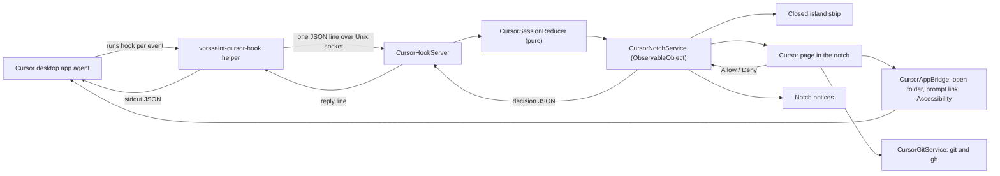

# Cursor Notch for Vorssaint: implementation plan

## 1. Goal and scope

Build **Cursor Notch**, a new notch module that keeps the Cursor desktop app and the Vorssaint notch in sync. You can watch the agent in the notch and use simple controls from either place.

In scope:
1. **Viewing:** what the Cursor app's agent is doing, live (section 5.1).
2. **Controlling:** simple controls from the notch (section 5.2).
3. **Premium feel:** an original mascot, state colors, fluid text, natural motion (section 5.3).
4. **Simulated streaming:** the reply appears with a typewriter animation, even though Cursor sends it whole (section 5.4).
5. **Extra suggestions** (section 5.5).

Out of scope (v1):
- Changing the existing AI usage tracker (`NotchModule.agents`) or any other utility.
- Cursor cloud agents. Your personal hooks file doesn't apply to them.
- Cursor's terminal agent as a primary target. Its sessions can be shown, hidden by default.
- Chat history from before Vorssaint was running, switching the model or mode, opening a specific chat tab.
- Lock screen activity, Windows support.

## 2. Decisions and assumptions

- **Add a new module; keep the existing AI tracker.** `NotchModule.agents` (Claude/Codex usage) stays as it is. Cursor gets its own module `NotchModule.cursor` and feature `AppFeature.notchCursor`.
- **Shared-file edits are additive only.** New enum cases, new switch branches, new optional parameters with defaults. Other modules behave exactly as before.
- **Opt-in.** `installedByDefault = false`. Approvals off by default. Experimental Accessibility controls off by default.
- **App sessions only by default.** Terminal-agent sessions are hidden unless the user enables them. `is_background_agent` is a separate badge, not the app-versus-terminal signal.
- **Hub symbol.** `bubble.left.and.bubble.right`. `cursorarrow.rays` is already used by mouse acceleration.
- **Energy label only.** `.periodic` matches the other island extensions in the Features hub. The hook server does not poll. The 30-second quiet tick runs only while a session exists.
- **Same-user trust.** `getpeereid` rejects other users. Any process of this user can connect to the socket. v1 does not add a shared secret.
- **No coucou assets.** The Mochi character, its sounds, icons and names are reserved by their author (`LICENSE-ASSETS.md`). The coucou code is MIT, but we write our own code and borrow only the ideas.
- **"Cursor" appears only as a product name.** No Cursor logo. It stays untranslated, like Claude and Codex.
- **Compatibility:** macOS 14+ (`TARGET="arm64-apple-macosx14.0"` in [build.sh](build.sh)). It must build on the CI's Swift 6.0.3 / Xcode 16.2 with no warnings. Any macOS 15-only SwiftUI API is gated with `#available` and has a fallback.
- **Follow [CONTRIBUTING.md](CONTRIBUTING.md):**
  - SPDX header on new files.
  - All 15 languages filled in.
  - Background work stops when the feature is off.
  - No edits to `CHANGELOG.md`.
  - PR title in the form `feat(notch): ...`.

## 3. Architecture

Components:
- **Hook helper (`vorssaint-cursor-hook`).**
  - A tiny, separately compiled executable. No AppKit.
  - It reads the hook payload from stdin, trims it, and sends one JSON line to the app's socket.
  - It prints only an allowlisted reply to stdout, or a safe fallback. Diagnostics go to stderr, never stdout.
  - It does not forward `pluginPaths`, `env`, or `updated_input`, even if the app asks. Those can load plugins, change later hook environments, or rewrite a tool call.
- **`CursorHookServer`.**
  - A Unix socket listener, owner-only access.
  - It holds open the connections that are waiting for a decision.
- **`CursorSessionReducer`.**
  - A pure function from (state, event, now) to the new state.
  - Fully unit tested.
- **`CursorNotchService`.**
  - A singleton like `AgentUsageService.shared`.
  - Publishes sessions and approvals, emits notice events, and is started and stopped by `NotchService.syncWithPreferences()`.
- **`CursorHookInstaller`.** Merges our entries into `~/.cursor/hooks.json`, with a backup, a preview and an uninstall.
- **`CursorAppBridge`.** Opens folders in Cursor, opens prompt links, and runs the experimental Accessibility actions.
- **`CursorGitService`.** Runs `git` and `gh` through [Sources/Vorssaint/Services/BoundedProcessRunner.swift](Sources/Vorssaint/Services/BoundedProcessRunner.swift).

## 4. Hook bridge contract

Hooks are registered only in the user file `~/.cursor/hooks.json`, and only when `"version"` is `1`. Project, team, and enterprise files are never written. Enterprise on macOS lives at `/Library/Application Support/Cursor/hooks.json`. The **command** is the absolute, quoted path of the installed helper copy, plus the event name as an argument. User hooks run with working directory `~/.cursor/`.

Cursor's exit rules, from the hooks docs: exit `0` uses the JSON on stdout, exit `2` denies, and any other failure **allows the action** unless that entry sets `failClosed: true`. The observation no-op is exit `0` with empty stdout or `{}`. Exit `1` is a failed hook, not a no-op.

**Stdout allowlist** (the helper drops every other key):

| Hook | Keys the helper may print |
| --- | --- |
| `beforeShellExecution`, `beforeMCPExecution` | `permission`, `user_message`, `agent_message` |
| `preToolUse` (edit approvals only) | `permission`, `user_message`, `agent_message` |
| `stop` | `followup_message` |
| `sessionStart`, and only when the context note is on | `additional_context` |
| Every other registered hook | nothing |

Never printed: `pluginPaths` (`workspaceOpen` would load those directories), `env` (`sessionStart` would export it into later hooks), `updated_input` (`preToolUse` would rewrite the tool call). `subagentStop` can return `followup_message`, which continues the subagent. v1 always prints nothing for it.

**Events registered:**
- **Observation** (connect timeout 300 ms; if the app does not answer, exit 0 with no output):
  - `sessionEnd`, `beforeSubmitPrompt` (must not return `continue: false`)
  - `afterAgentThought`, `afterAgentResponse`
  - `postToolUse`, `postToolUseFailure`
  - `afterShellExecution`, `afterMCPExecution`, `afterFileEdit`
  - `subagentStart`, `subagentStop`, `preCompact`
  - `workspaceOpen` (feeds the repo list; stdout stays empty)
  - `sessionStart` when the context note is off. Docs describe it as fire-and-forget. When the note is on, the helper still answers immediately from the local note. It does not wait on the user. Phase 0 checks that a fast `additional_context` actually lands.
- **Step starts, fast when approvals are off.** `beforeShellExecution`, `beforeMCPExecution`, and `preToolUse` stay registered so the strip can show running or editing before the tool finishes. The helper still treats those event names as approvals, so the installer passes `--wait=1` (not the 95-second approval wait) and a Cursor `timeout` of 10. Shell and MCP also pass `--fallback=ask` while approvals are off, or while the hand-back setting is on, so a missed reply returns Cursor's own prompt instead of a deny. `preToolUse` never passes `--fallback`. Phase 0 confirms that empty output does not block.
- **Approvals, which block** while the matching setting is on. The installer rewrites these entries when the setting changes.
  - Shell: `beforeShellExecution` only.
  - MCP: `beforeMCPExecution` only.
  - Edits: `preToolUse` with a matcher limited to edit tools. Docs list `Write` and `Delete`. Phase 0 records the real `tool_name` values and the matcher includes those too. The matcher is mandatory. It never includes `Shell` or `MCP:…`, or the same action would prompt twice.
  - Docs: `preToolUse` accepts `"ask"` but does not enforce it. Edit approvals are allow or deny only. `"ask"` on `subagentStart` is treated as deny, so that hook stays an empty observation.
  - Approval entries set `failClosed: true`. On Cursor 3.23.12 a crashed hook denies the action and tells the agent; it does not freeze the window. Observation entries stay fail-open. Invalid JSON from a permission hook is also denied, so the helper must print empty stdout or valid allowlisted JSON.
  - Two clocks. Connect failure is about 300 ms for every hook. The approval wait starts only after the socket accepts. Then the app's approval timeout (the setting) is shorter than the helper's wait (setting plus 5 seconds), which is shorter than Cursor's `timeout` (setting plus 15 seconds).
- **Follow-ups:** `stop`.
  - Returns `followup_message` when a message is queued, or when hold-for-reply has text and the queue is empty.
  - Only when `status` is `completed`, unless the aborted-turn setting is on. Never when `status` is `error`. Never when `loop_count` is already greater than 0.
  - The queue is cleared as the reply is sent, so the follow-up's own stop cannot send it again.
  - `loop_limit` is `1`, plus the app-side guard. It is not `null`. The installer writes it on the stop entry.
  - `timeout` is the hold-for-reply time plus 10 seconds. When hold-for-reply is off, the helper does not block: it returns the queued message or empty stdout immediately.

**Not registered:** `beforeReadFile` (it carries file contents, fires very often, and is a permission hook) and the Tab hooks. Reads are seen through `postToolUse` with tool `Read` or `Grep`. If a payload unexpectedly contains file contents, the trimmer drops them.

**Protocol between helper and app (version 1):**
- **Request:** `{"v":1,"hook":"<event>","source":"app|terminal","remote":false,"payload":{...trimmed...}}`
- `remote` is true when the helper sees `CURSOR_CODE_REMOTE=true`. The app never sees the helper's environment otherwise.
- **Reply:** `{"stdout":"<allowlisted JSON, or empty>","exit":0}`
- The helper still filters that stdout through the allowlist above.

**Trimming in the helper** (for privacy and size):
- Drop `user_email`, `CURSOR_USER_EMAIL`, attachment contents, and file contents.
- Do not read `transcript_path` or `CURSOR_TRANSCRIPT_PATH`.
- Caps:
  - prompt: 2 KB
  - thought: 4 KB
  - reply: 16 KB
  - shell output: last 8 KB of the first 4 MB read, with a `truncated` flag when the cap is hit
  - each edit's old and new text: 16 KB, with a `truncated` flag
- Total request: 512 KB or less. The server rejects a request over 1 MB.

**Fallbacks:**
- **App not running, feature off, or socket missing (connect fails):**
  - Observation hooks exit 0 with no output.
  - Approval hooks answer with Cursor's normal flow (the verified "defer" output from Phase 0), still inside the allowlist.
  - The `stop` hook sends no follow-up.
- **Approval with no answer before the timeout:** the user's setting decides.
  - Deny is the default, with an `agent_message` asking the agent to check with the user in chat.
  - Or hand back to Cursor, for shell and MCP only. Edit approvals cannot hand back, because `preToolUse` does not enforce `"ask"`. The settings say so.
- **The island can't be shown** (notch disabled, suspended, hidden in full screen, screen locked): the server stays up and answers at once with the defer fallback, so nobody is blocked by a prompt they can't see. Hiding the island does not pause the socket.
- **The user is busy in another notch page** (`keepsWorkingSurface` is true, for example a menu, sheet or text field is active): the island isn't switched away from that page. A notice appears instead, and the approval waits for its normal timeout.
- **More than 8 approvals already held:** the extra one gets the fallback immediately, and a notice says an approval was answered automatically.

**Event order:** each hook runs in its own helper process, so events can arrive slightly out of order (for example a `postToolUse` before its `preToolUse`). The reducer matches steps by `tool_use_id` where present, and otherwise tolerates a finish without a start. A new `generation_id` clears that chat's thought and reply. Subagent events nest under `parent_conversation_id` when that field is present, instead of becoming their own chat row.

## 5. Feature checklist (every possible item)

### 5.1 Viewing what the app is doing

- [ ] **V1 Active chats list.** One row per `conversation_id`, with the project name from `workspace_roots[0]`. Created on `sessionStart`, or lazily on the first event of a chat that was already running.
- [ ] **V2 Live state.** idle, sent, thinking, reading, searching, editing, running, waiting for approval, subagent, done, stopped, failed, quiet. Quiet means no event for 10 minutes while working.
- [ ] **V3 Prompt sent.** From `beforeSubmitPrompt.prompt`, shown truncated.
- [ ] **V4 Step timeline.** Human-readable, localized labels in the style of coucou's `frenchStep`: Read `file`, Search "query", Edit `file`, Run `cmd`, MCP `server.tool`, Subagent `task`, Delete `file`. Labels come from `tool_input` and the shell `command`. `postToolUse.tool_output` is a JSON string, not terminal text. Up to 50 steps per session, the last 6 visible.
- [ ] **V5 Failed or interrupted steps.** From `postToolUseFailure`. When `is_interrupt` is set, the step shows as "Stopped". `failure_type` `permission_denied` shows as "Denied", distinct from an error.
- [ ] **V6 Edited files with a mini diff.** From `afterFileEdit.edits`, as a line diff using `CollectionDifference`, with +/- counts and at most 200 lines per file. The diff runs off the main actor. Truncated edits show a badge.
- [ ] **V7 Shell command output.** The tail of `afterShellExecution.output`, with `duration` in milliseconds (not `duration_ms`). A sandboxed command shows a badge from the `sandbox` field.
- [ ] **V8 Thinking text.** From `afterAgentThought` (text and `duration_ms`), dimmed with a shimmer.
- [ ] **V9 Final reply.** From `afterAgentResponse.text`, rendered with the typewriter effect (5.4). A new `generation_id` clears the previous thought and reply.
- [ ] **V10 Subagents.** From `subagentStart`/`subagentStop`: type, task, status, summary, modified files. Nested under the parent chat when `parent_conversation_id` is present.
- [ ] **V11 Model in use.** From `model_id`, falling back to `model`.
- [ ] **V12 Duration and finish.** `stop.status` (completed, aborted, error) plus `sessionEnd.duration_ms` and `sessionEnd.reason`. Leads to the done animation and a notice.
- [ ] **V13 Context filling up.** A small meter from `preCompact`: `context_usage_percent`, `context_tokens`, and `context_window_size`. `preCompact` cannot block compaction. Its stdout stays empty, so Cursor does not show a `user_message` from us.
- [ ] **V14 Tokens per turn.** Cursor 3.23.12's `afterAgentResponse` payload can include optional `input_tokens`, `output_tokens`, `cache_read_tokens`, and `cache_write_tokens`. Show them when present. Hide the meter when they are absent.
- [ ] **V15 App or terminal label.** The helper walks its parent processes. An ancestor inside `Cursor.app/Contents` means app; otherwise terminal. The filter is a setting. `is_background_agent` draws a separate "Background" badge and does not change this label.
- [ ] **V16 Several windows and chats.** Sessions are grouped by workspace, and a switcher shows chips per chat.
- [ ] **V17 Cursor quit.** When Cursor terminates (`NSWorkspace.didTerminateApplicationNotification` for Cursor's stable or Nightly bundle id), every session ends.
- [ ] **V18 Chat mode badge.** From `sessionStart.composer_mode`. Documented values are `agent`, `ask`, and `edit`. The chip shows those labels, and any other string (Phase 0 checks for `plan`) as the raw value.
- [ ] **V19 Remote workspaces.** The helper sets `remote` when `CURSOR_CODE_REMOTE` is `"true"` (SSH or container workspaces). Paths are on the other machine, so PR actions, opening files, and adding the folder to the repo list are disabled. Viewing and approvals still work. A path that happens to exist on this Mac is not enough to treat the session as local.
- [ ] **V20 Sleep and wake.** After the Mac wakes, sessions whose last event is older than the quiet threshold switch to quiet straight away instead of looking busy.

### 5.2 Controlling the app from the notch

- [ ] **C1 Allow or deny a shell command or MCP call.**
  - The approval card shows the command in monospace, the working folder, the project, and a countdown ring.
  - Buttons: Deny, Allow, Always allow (adds a rule), Answer in Cursor (defers).
  - With several pending approvals, they're shown one at a time ("1 of 3").
- [ ] **C2 Block file edits before they happen.** Optional `preToolUse` approval for the edit tools Phase 0 records (`Write` and `Delete`, plus any other edit tool the fixtures show). It can be limited to protected paths (see X1). There is no "hand back" for edits.
- [ ] **C3 Your own allow and deny rules.**
  - Rules match command prefixes token by token (not regexes) and MCP server plus tool name.
  - Deny wins over allow. The longest matching token prefix wins.
  - "Always allow" shows the exact tokens before saving. A risky pattern (X2) still prompts even when an allow rule matches.
  - A matching rule answers at once, and the timeline shows "auto-allowed by rule" or "auto-denied by rule".
  - Stored rules are capped.
- [ ] **C4 Queue a message that sends when the turn ends.**
  - One editable queued message per chat, delivered by the `stop` hook as `followup_message`, only when `status == completed` (a setting allows aborted turns too). Never on `error`. Never when `loop_count` is already greater than 0.
  - The queue is cleared as it is sent. A queued message is sent before hold-for-reply opens.
- [ ] **C5 Reply right when a chat finishes.**
  - Setting "Hold for reply": off, 30, 60 or 120 seconds. Off by default.
  - Runs only when the queue is empty.
  - While the `stop` hook waits, the notch shows the composer with a countdown. Send delivers the follow-up; Skip or Escape releases the hook immediately.
  - Settings warn that the agent stays idle until send, skip, or timeout.
- [ ] **C6 New message in a chosen repo.**
  - The repo picker lists folders seen in hook events and `workspaceOpen`, plus "Add folder..." (`NSOpenPanel`).
  - Flow:
    1. Open the folder with `NSWorkspace.open(_:withApplicationAt:configuration:)` using Cursor's app URL.
    2. Wait up to 3 seconds for Cursor to come to the front.
    3. Open `cursor://anysphere.cursor-deeplink/prompt?text=<encoded>`.
    4. The user presses Enter in Cursor.
  - The composer rejects the link when `21 + encodeURIComponent(text).length` is over 10,000, which is what Cursor 3.23.12 checks. The link only prefills the composer. The user confirms it in Cursor.
  - If both stable Cursor and Nightly are installed, Phase 0 records which app owns `cursor://`. The bridge warns when that owner is not the app it just opened.
- [ ] **C7 Jump to the right Cursor window.** Open the session's workspace folder in Cursor, which brings that window forward. Clicking a file in V6 opens that file in Cursor.
- [ ] **C8 Create PR, view checks, merge PR.** Details in Phase 6.
- [ ] **C9 Notices.** Done, failed, needs approval (when the island can't open by itself), approval answered automatically because the queue was full, and waiting for reply. The option "Quiet while Cursor is in front" doesn't apply to approvals. Notices do not include the prompt body.
- [ ] **C10 Experimental: send a message right away** (Accessibility).
  - Steps:
    1. Bring the session's window forward.
    2. Check the window title contains the project name, using Accessibility.
    3. Press the shortcut that focuses the chat.
    4. Paste with `TransientPaste.shared.paste` ([Sources/Vorssaint/Services/TransientPaste.swift](Sources/Vorssaint/Services/TransientPaste.swift)).
    5. Press Return.
  - Shortcuts are configurable, with defaults verified in Phase 0.
- [ ] **C11 Experimental: stop the run.** Accessibility shortcut, with the same window check.
- [ ] **C12 Experimental: Keep All or Undo All.** Accessibility shortcut, with the same window check. A confirmation is required for Undo All.
- [ ] **C13 Add context to every new chat.** When the note is on, `sessionStart` returns only `additional_context` from that note, immediately. Off by default. The note is a registered preference, so it is included in settings backups. The field does not return `env`.

### 5.3 Premium feel

- [ ] **P1 Original mascot ("Cursor Buddy", working name).**
  - Drawn with CALayers and shapes, with no image assets, following the no-timers, visibility-aware pattern of [Sources/Vorssaint/UI/Notch/NotchAgentAnimationView.swift](Sources/Vorssaint/UI/Notch/NotchAgentAnimationView.swift).
  - Poses:
    - idle: breathing and blinks
    - thinking: eyes up, three orbiting dots
    - reading: eyes scanning
    - editing: typing bob
    - running: spinning ring
    - waiting: wide eyes with an orange pulse
    - done: a hop and a green ring burst
    - failed: a small shake, red
    - quiet: sleepy eyes
- [ ] **P2 State colors.**
  - One palette in the support file:
    - thinking: violet
    - reading and searching: blue
    - editing: teal
    - running: amber
    - waiting: orange
    - done: green
    - failed: red
    - idle: white at 60%
  - A high-contrast variant when "Increase contrast" is on.
- [ ] **P3 Fluid text.**
  - `.contentTransition(.numericText())` for clocks and counters.
  - A push/blur transition when the state word changes.
  - A shimmer gradient on the active step, animated only while visible.
- [ ] **P4 Island motion.**
  - Approvals open the island with the island's existing springs.
  - Done gives the mascot hop and a short glow; failed gives a small shake.
- [ ] **P5 Working glow on the closed island** (optional). A subtle moving gradient edge in the state color, paused when hidden or when Low Power Mode is on.
- [ ] **P6 Sounds** (optional, off by default). macOS system sounds only, for approval, done and failed. No coucou sounds.
- [ ] **P7 Haptics.** On Allow and Deny, when `NotchSupport.usesHapticFeedback()` is on.
- [ ] **P8 Onboarding.** A "Connect Cursor" card with the mascot waving, and a three-step connect flow (preview, confirm, test event).
- [ ] **P9 Reduce Motion.** Every animation has a crossfade or static fallback, read from `accessibilityReduceMotion` as the other notch views do.

### 5.4 Simulated word-by-word reply

- [ ] **S1 `NotchTypewriterText`.**
  - Reveals a reply that arrived whole at about 90 characters per second, capped at 2.5 seconds, with a blinking caret.
  - Click to show it all at once.
  - Animates only the first time a reply is shown. Long replies reveal the first 600 characters, then "Show more".
  - Driven by a SwiftUI `TimelineView(.animation)` that exists only during the reveal and only while the page is visible.
  - With Reduce Motion on, it fades in instead.
- [ ] **S2 The same effect, dimmed, for thinking text** (V8).

### 5.5 Extra suggestions

- [ ] **X1 Protected paths:** ask before edits only for chosen globs (pairs with C2). A glob matches the relative path and the basename, so `.env*` matches a nested `.env`. Not regexes.
- [ ] **X2 Risky command highlight:** a red badge in the timeline and on the approval card for patterns such as `rm -rf`, `git push --force`, `curl | sh`, and an always-deny list. An allow rule does not skip the prompt for a risky command.
- [ ] **X3 Turn summary at finish:** files changed, commands run, failures, duration. Shown in the notice and the card.
- [ ] **X4 Copy buttons:** command, reply, file path.
- [ ] **X5 "Needs you" badge** on the closed island when several chats are waiting.
- [ ] **X6 Quiet while Cursor is in front** (approvals excepted).
- [ ] **X7 "Clear" button** and automatic removal of ended sessions after 1 hour. Nothing is written to disk. Caps: 20 sessions, 50 steps, a bounded set of retained edits, and one shell tail per step. Decoding errors omit the payload.
- [ ] **X8 Future, not in v1:** Claude Code through the same bridge; Cursor cloud agents through the Cloud Agents API.

## 6. Step-by-step phases

### Phase 0: Verification spike

Install a throwaway logging hook script for every event in a test `~/.cursor/hooks.json` (backed up first). Record the answers below; each finding goes into section 9.

- [x] **S0.1** Capture real payloads in the Cursor app. The live fixture is `Tests/Fixtures/cursor-hooks/beforeShellExecution.json`. Other event shapes are from Cursor 3.23.12's hook protobuf, recorded in section 9.
- [x] **S0.2** For each permission-capable hook (`beforeSubmitPrompt`, `preToolUse`, `beforeShellExecution`, `beforeMCPExecution`, `subagentStart`), confirm the no-op is exit 0 with empty stdout or `{}`. Record what exit `1` and exit `2` actually do. `beforeSubmitPrompt` must keep submitting (`continue` stays true). `subagentStart` must not return `"ask"`.
- [x] **S0.3** Does `{"permission":"allow"}` from `beforeShellExecution` skip Cursor's own approval prompt? Does `"ask"` show Cursor's prompt in the app? Does `deny` plus `agent_message` reach the agent?
- [x] **S0.4** A hook waiting 60 to 120 seconds: what does Cursor's interface show, is the configured `timeout` honoured, and is there a maximum?
- [x] **S0.5** `stop` with a 60-second wait, then `followup_message`: is it delivered into the same chat, what does the interface show while waiting, and what does `loop_limit` do?
- [x] **S0.6** Prompt link: a missing workspace name continues in the current window, and the link is rejected when `21 + encodeURIComponent(text).length` is over 10,000. It only prefills the composer.
- [x] **S0.7** Shortcuts in the current Cursor version for focusing the chat, stopping, Keep All and Undo All.
- [x] **S0.8** Telling app from terminal: parent-process chain and `TERM_PROGRAM`. Record `composer_mode` strings separately (`agent`, `ask`, `edit`, and any `plan`). Record `is_background_agent` as its own flag, not as the terminal signal.
- [x] **S0.9** Hook overhead: time from hook start to exit for the helper, for both observation and approval hooks.
- [x] **S0.10** Opening an already-open folder focuses its existing window. Opening a file in Cursor works.
- [x] **S0.11** Commands with spaces in the path (`Application Support`): how Cursor runs `command`, and which quoting works.
- [x] **S0.12** Cursor's bundle ids (stable and Nightly), the URL schemes each registers, and which app owns `cursor://` when both are installed.
- [x] **S0.13** `workspaceOpen` with empty stdout: Cursor does not log an error and does not load extra plugins. Confirm a returned `pluginPaths` would be acted on, so v1 must never send one.
- [x] **S0.14** `failClosed: true` on `beforeShellExecution`: a crashed or timed-out helper denies the command instead of freezing the agent. If it wedges the UI, leave `failClosed` off and record that.
- [x] **S0.15** Real `tool_name` values for edits (`Write`, `Delete`, and anything else the agent uses). The `preToolUse` matcher is built from this list.
- [x] **S0.16** A fast `sessionStart` reply of `{"additional_context":"..."}` lands in the new chat. A slow reply does not, which matches the fire-and-forget docs.
- [x] **S0.17** Cursor window-title format was not read. No-go for a hardcoded title match until a format is verified.
- [x] **S0.18** Shell output shape: `afterShellExecution.output` is the terminal tail, and `postToolUse.tool_output` is JSON. `duration` versus `duration_ms` matches section 5.
- [x] **S0.19** Subagent payloads: is `conversation_id` the parent or a new id, and is `parent_conversation_id` always set?
- [x] **Exit:** the findings are filled in, with go or no-go for C2, C10, C11, C12, C13, V14, and `failClosed`.

### Phase 1: Module skeleton (additive wiring only)

- [x] **[Sources/Vorssaint/Core/FeatureCatalog.swift](Sources/Vorssaint/Core/FeatureCatalog.swift):** add `case notchCursor` next to `notchAgents` (line 34), and a branch at every site that lists `notchAgents` today:
  - group: the Dynamic Island list (line 118)
  - `symbolName`: `bubble.left.and.bubble.right` (line 190). Do not use `cursorarrow.rays`; mouse acceleration already does.
  - `enabledKeys`: `[DefaultsKey.notchCursorEnabled]` (line 261)
  - permissions: `[]` (line 327). Accessibility is requested later, only when the experimental toggle is turned on.
  - Leave `notchCursor` **out** of the `installedByDefault: true` list (line 461). `notchAgents` is in that list; Cursor is not. The dynamic-island group still picks it up as an extension.
- [x] **[Sources/Vorssaint/Core/FeaturePresets.swift](Sources/Vorssaint/Core/FeaturePresets.swift):** add `.notchCursor` to the `.periodic` energy profile branch (line 121). It joins no preset. This is the hub label only. The service must not grow a poll timer.
- [x] **[Sources/Vorssaint/App/FeatureRuntime.swift](Sources/Vorssaint/App/FeatureRuntime.swift):** add a binding next to `.notchAgents` (line 368): sync through `NotchService`, or stop `CursorNotchService` when the feature is off.
- [x] **[Sources/Vorssaint/UI/Settings/FeatureVisibilitySupport.swift](Sources/Vorssaint/UI/Settings/FeatureVisibilitySupport.swift):** add `.notchCursor` to `settingsDestination` (line 343) and to `features(for: .notch)` (line 397). `settingsDestination` is exhaustive and will not compile without the new case.
- [x] **[Sources/Vorssaint/UI/Settings/FeatureHubSettings.swift](Sources/Vorssaint/UI/Settings/FeatureHubSettings.swift):** hub title and description next to `.notchAgents` (around lines 1044 and 1125).
- [x] **[Sources/Vorssaint/UI/Settings/SettingsDirectory.swift](Sources/Vorssaint/UI/Settings/SettingsDirectory.swift):** search keywords next to the agents entry (around line 353).
- [x] **Search check:** run `rg "\.notchAgents\b"` and `rg "case \.agents\b"` across `Sources/` and `Tests/`. The first search misses `NotchModule` switches. Each match gets a cursor counterpart or an explicit v1 skip. The lock screen (`NotchLockScreenActivity` and `NotchLockScreenView`) is a deliberate skip. `NotchIdleContent` stays without a cursor resting wing in v1.
- [x] **[Sources/Vorssaint/Core/Defaults.swift](Sources/Vorssaint/Core/Defaults.swift):** add the `notchCursor*` keys from section 7 and register their defaults.
  - Register the machine-specific keys `notchCursorRecentRepos` and `notchCursorHookState` nowhere, so they stay out of settings backups, following the `notchCalendarChosenCountdowns` pattern. Do not add them to `registeredDefaults` or `machineStateKeys`.
  - The context note, rules, and protected paths **are** registered, so they do travel in backups.
- [x] **[Sources/Vorssaint/Services/Notch/NotchSupport.swift](Sources/Vorssaint/Services/Notch/NotchSupport.swift):**
  - `NotchModule.cursor`: symbol, `shortcutKey` "u" (currently unused), and `isAvailable`.
  - `modules(in:)`: gate on `notchCursorEnabled`.
  - `NotchCompactActivity.cursor`: title, module, symbol.
  - `compactActivities(..., cursor: Bool = false)`: `.cursor` goes just before `.agents`. The order with `cursor == false` doesn't change.
  - `compactCompanions`: cursor pairs where agents pair.
  - `NotchEvent.cursor`: preference key, priority 1, duration 5. One event type covers finish, failure, and approval notices; the notice symbol distinguishes them.
  - `NotchSupport.routes(_:in:)` (around line 1497): a `.cursor` branch that checks the feature and that the module is shown, like `.agents`.
  - `NotchGeometry.expandedSize`: a cursor branch. The page scrolls inside that budget.
  - `timerMarkWidth` if cursor can sit beside the timer the way agents can.
  - `NotchModule` raw values are stored in `notchModuleOrder`. Adding `cursor` does not renumber existing modules. Users with a saved order see it appended.
  - Existing tests that loop over `NotchModule.allCases` (shortcut uniqueness, titles, sizing) must pass with the new case.
- [x] **[Sources/Vorssaint/UI/Notch/NotchView.swift](Sources/Vorssaint/UI/Notch/NotchView.swift):** the module title lives on `NotchModule` (`PanelOrderItem`), not a `NotchView.title` method. Also `pageSize`, a content branch rendering `NotchCursorView`, an `activityStrip` branch, and the resting strip only if a cursor idle wing is added (v1 leaves `NotchIdleContent` unchanged).
- [x] **NotchMirrorView, NotchCapsuleViews, NotchNoticeView, NotchTimerStrip:** cursor branches for the strip, the capsule, the notice tint, and timer companion marks.
- [x] **NotchContentEditor and NotchEditorStrings:** preview, tint, glyph and summary. `NotchLayoutEditor` picks up the module through `NotchModule.allCases`.
- [x] **[Sources/Vorssaint/Services/Notch/NotchService.swift](Sources/Vorssaint/Services/Notch/NotchService.swift):** stub the new `NotchModule` and `NotchEvent` cases so Phase 1 compiles. Real subscriptions land in Phase 4. Switches include compact geometry, the activity strip, `activateNotice`, and `bindEvents`.
- [x] **[Sources/Vorssaint/UI/Settings/NotchSettings.swift](Sources/Vorssaint/UI/Settings/NotchSettings.swift):** `moduleOptions` (renders `NotchCursorSettingsControls`), `moduleFeature`, `moduleBinding`.
- [x] **New `NotchCursorStrings.swift`:** all strings with all 15 languages, plus a `FeatureStrings.notchCursor(_:)` factory.
- [x] **Placeholder page:** a "Connect Cursor" empty state.
- [x] **[Tests/FeatureCatalogTests.swift](Tests/FeatureCatalogTests.swift):** count goes from 74 to 75. Insert `"notchCursor"` immediately after `"notchAgents"` in the pinned raw-value list. Keep it out of the installed-by-default pins.
- [x] **Check:** `./build.sh`, `./build/Vorssaint --selftest`, and `./build.sh --test` all pass. Existing tests are unchanged apart from that catalog pin and any `NotchModule.allCases` counts.

### Phase 2: Hook bridge

- [x] **`Sources/VorssaintCursorHook/main.swift`:**
  - Reads stdin, capped at 4 MB. Shell tails keep the last 8 KB of what was read.
  - Trims the payload (section 4), detects app or terminal (S0.8), and sets `remote` from `CURSOR_CODE_REMOTE`.
  - Connects with `SO_NOSIGPIPE`. Connect timeout is 300 ms for every hook. After accept, an approval hook waits for the decision; an observation hook does not.
  - Writes one line, reads one reply line, prints only the allowlisted keys, and exits 0, or falls back.
  - `--selftest` checks encoding, the allowlist (including rejection of `pluginPaths`, `env`, and `updated_input`), and fallbacks.
- [x] **`Sources/Vorssaint/Services/CursorNotch/CursorHookProtocol.swift`:** request and reply types, the socket path rule, and size caps. It's compiled into both the app and the helper, the way `FanControlXPC.swift` is shared.
- [x] **Socket path:** `~/Library/Application Support/<app support dir>/CursorHook/hook.sock`.
  - The folder is 0700 and the socket 0600.
  - If the path is longer than 103 bytes, both sides use `/tmp/vorssaint-<uid>/cursor.sock` instead, after checking the folder's owner and mode.
  - A separate folder per bundle id keeps dev builds apart.
- [x] **`CursorHookServer.swift`:**
  - The accept loop runs off the main thread.
  - Peer checks: `getpeereid` must match the user's id. That stops other users. It does not stop other processes of this user. A 5-second receive timeout; a 1 MB request cap; at most 32 connections; at most 8 held approvals, with the fallback and a notice beyond that.
  - At start it removes a stale socket only if it is a socket owned by us.
  - `stop()` answers every held connection with the fallback before closing. App termination calls `stop()` too.
  - Threading: socket work stays on its own queue; every state change hops to the main actor before touching `CursorNotchService`. Types crossing that boundary are `Sendable`, so the CI's Swift 6.0.3 build has no concurrency warnings.
- [x] **[build.sh](build.sh):**
  - Compile the helper (`build/vorssaint-cursor-hook`) and run its `--selftest`.
  - Stage it at `Contents/Helpers/vorssaint-cursor-hook`. That directory is new. Leave the fan helper in `Contents/Library/LaunchServices/`.
  - Sign it the way `codesign_fan_helper` is signed: Developer ID, legacy, or ad-hoc, hardened runtime and timestamp when a Developer ID exists, its own identifier, and **no** app entitlements file.
  - Sign the helper inside `sign_bundle` **before** the outer app signature. `codesign --verify --deep --strict` on the bundle must succeed.
  - Add the new support files to `TEST_SOURCES`.
- [x] **Installed copy:** when connecting, copy the bundled helper with `ditto` to `.../CursorHook/vorssaint-cursor-hook` (0755). On each launch, if the bundled helper's hash differs, replace the copy by writing aside and renaming. `hooks.json` always points to the stable copy, so moving or updating the app doesn't break it.
  - Before copying, check the bundled helper's signature with `codesign --verify`. Verify the copy after `ditto`. Files written by the app carry no quarantine flag, so Cursor can run it without a Gatekeeper prompt.

### Phase 3: Hook installer and Connect flow

- [x] **`CursorHookInstaller.swift`:**
  - Reads `~/.cursor/hooks.json`, or starts from `{"version":1,"hooks":{}}`.
  - Refuses a symlink, a `version` other than `1`, or a file it can't parse, and shows manual steps instead.
  - Treats the file as generic JSON. Unknown top-level keys and other people's entries stay, in order, including `type: "prompt"` hooks and fields this installer does not model.
  - Merges: our entries are recognised by the helper path after quote-normalizing. Re-read and merge immediately before the atomic write so an edit made while the preview was open is not overwritten.
  - Backup `hooks.json.bak-yyyyMMdd-HHmmss` on Connect. Silent setting rewrites do not create a new backup every time. Keep the last 5 backups.
  - A file created by the installer is mode 0600. An existing file keeps its mode.
  - `uninstall()` removes only our entries.
  - `status()` returns one of: not installed, installed, needs update (outdated entries or helper), or unreadable.
- [x] **Other Vorssaint copies:** if `hooks.json` already has entries for another Vorssaint helper (a dev build and a release build, for example), the installer warns and offers to replace them. Two helpers answering the same approval would conflict.
- [x] **Connect UI (settings and empty state):**
  - Preview the exact JSON change, then Confirm.
  - Then the "Waiting for Cursor..." test. It turns green on the first event, with a hint to send any message in Cursor.
  - A "Test connection" button runs the installed helper with a synthetic event, which proves the helper and socket work without needing Cursor.
- [x] **Health after install:**
  - Settings shows "Last event from Cursor: <time>". Hooks can be installed yet silent, for example if the user turned them off in Cursor's Customize > Hooks tab.
  - The status is re-checked when the settings page opens and when Vorssaint becomes active, because the user or Cursor can edit `hooks.json` at any time. Cursor reloads the file on save, so no restart is needed.
- [x] **Keeping hooks in step with settings:** turning approvals, edit approvals or hold-for-reply on or off rewrites our entries silently after the first confirmed install. A small notice says the hooks were updated.
- [x] **Disconnect:** settings has a Disconnect button. Uninstalling the feature offers to remove the hooks. Both uninstall paths remove our entries and the helper folder:
  - `--uninstall` in [Sources/Vorssaint/Support/Uninstaller.swift](Sources/Vorssaint/Support/Uninstaller.swift)
  - "Uninstall Vorssaint completely" in [Sources/Vorssaint/Services/SelfUninstall.swift](Sources/Vorssaint/Services/SelfUninstall.swift) (`uninstallCompletely`)
  - Today neither path knows about Cursor hooks. This is new work, not a call to an existing cleanup.

### Phase 4: Viewing

- [x] **`CursorNotchModels.swift`:**
  - `CursorSession`: id, source, remote, background, mode, root, project, model, generation id, started, last event, state, steps, edits, thought, reply, subagents, context, finish.
  - `CursorStep`, `CursorEdit`, `CursorApproval`, `CursorNotchEvent`.
- [x] **`CursorHookEvent` decoding:** tolerant of unknown or missing fields, and tested against the Phase 0 fixtures.
- [x] **`CursorSessionReducer`:**
  - State transitions, step labels and caps (20 sessions, 50 steps, bounded edits, one shell tail per step).
  - A new `generation_id` clears thought and reply. Subagents attach to `parent_conversation_id`.
  - Quiet after 10 minutes; removal 1 hour after ending.
  - Cursor quit ends every session (V17); wake re-evaluates quiet (V20).
  - Time-based changes (quiet, removal) are applied by a 30-second tick that runs only while at least one session is active, so there is no timer while idle.
- [x] **Formatting:** reuse `AgentFormat.clock` and `AgentFormat.duration` from [Sources/Vorssaint/Services/Notch/NotchAgentSupport.swift](Sources/Vorssaint/Services/Notch/NotchAgentSupport.swift) for elapsed times and durations, so they match the AI page.
- [x] **`CursorNotchService`:**
  - Owns the server.
  - `syncWithPreferences()` and `stop()`, mirroring `AgentUsageService` for feature on and off.
  - `pause()` stops animations and UI updates only. The socket keeps accepting and defers approvals while the island is hidden, locked, or full screen. Pausing the server would stall Cursor until the hook timeout.
  - `@Published` sessions and approvals.
  - `events` subject for notices.
- [x] **[Sources/Vorssaint/Services/Notch/NotchService.swift](Sources/Vorssaint/Services/Notch/NotchService.swift):**
  - `hasCursorActivity` passed into `compactActivities`.
  - Subscribe to `CursorNotchService.events` when `NotchSupport.routes(.cursor)` is true, through a new `showCursorEvent`.
  - `activateNotice` maps `.cursor` to `open(.cursor)`.
  - Start and stop alongside `AgentUsageService` in `syncWithPreferences` and `stop`.
- [x] **`NotchCursorStrip`:**
  - Left wing: the mascot glyph in the state color.
  - Right wing: the chosen readout (state word, elapsed time, or project), with fluid transitions and an orange pulse while an approval is pending.
  - Also a capsule and a mirror variant.
- [x] **`NotchCursorView` page layout:** a `ScrollView` inside the expanded-size budget from Phase 1.
  1. Header: session chips with App, Terminal, Remote, Background, and mode badges, the large mascot, the model. Connection status can show `cursor_version` from the last payload.
  2. Live card: state, current step with a shimmer, elapsed time.
  3. Timeline.
  4. Edits card with expandable `NotchCursorDiffView`.
  5. Thinking (collapsed).
  6. Reply with the typewriter effect.
  7. Footer: composer and actions.
- [x] **Done, failed and "needs you" notices:** use `NotchNotice(event: .cursor, ...)`, with the turn summary (X3) as the detail.
- [x] **VoiceOver:** the mascot and decorative layers are hidden from accessibility; every button, chip and card has a label; state changes post an accessibility announcement only for approvals and finishes.

### Phase 5: Controls

- [x] **Approvals (C1, C2, C3):**
  - The server holds the connection and the service publishes the `CursorApproval`.
  - If the island can be shown and the "open for approvals" setting is on, call `NotchService.open(.cursor)`. Otherwise show a notice, or defer at once (section 4).
  - Add `(expanded && selected == .cursor && CursorNotchService.shared.keepsSurface)` to `keepsWorkingSurface`, so a click elsewhere doesn't close an open approval.
  - Keyboard while the card is focused: A for Allow, D for Deny. Escape goes back without deciding.
  - Timeout policy per setting; rule matching before any interface appears. Deny beats allow. Longest token prefix wins. Risky commands still prompt.
  - A and D apply only while the approval card is focused and the composer is not.
  - The 9th held approval uses the fallback immediately and posts the C9 notice.
- [x] **Queue and reply (C4, C5):** composer component `NotchCursorComposer`, with focus handled the way the notch's existing text-input pages do. The `stop` handler returns `followup_message` under the section 4 rules: queued message first, hold-for-reply only if the queue is empty, `loop_count` guard, queue cleared on send.
- [x] **New chat in a repo (C6):** `CursorAppBridge.openFolder` plus `openPromptLink`. The repo list is kept in `notchCursorRecentRepos`, deduplicated and capped at 20. The counter uses `21 + encodeURIComponent(text).length`, limit 10,000. Remote sessions cannot be added.
- [x] **Jump (C7):** `CursorAppBridge.focus(workspace:)` and `open(file:)`.
- [x] **Finding Cursor:** `CursorAppBridge` resolves the app with `NSWorkspace.urlForApplication(withBundleIdentifier:)`, trying the stable bundle id first and then Nightly (ids confirmed in S0.12). If neither is installed, the controls that need the app are hidden.
- [x] **Context note (C13):** a settings text field, returned by the `sessionStart` handler.

### Phase 6: Git and pull requests (C8)

- [x] **`CursorGitService`:**
  - Finds `gh` like the candidate search in `AgentCodexServer.candidates(apps:home:searchPath:)`: Homebrew paths, `/usr/local/bin`, then the login shell's PATH.
  - `gh auth status` decides between a "Sign in to GitHub CLI" hint and the PR card.
- [x] **Status:**
  - From `git`: `rev-parse --abbrev-ref HEAD`, `status --porcelain`, `rev-list --count @{u}..HEAD`.
  - From `gh`: `repo view --json defaultBranchRef`, and `pr view --json number,url,state,isDraft,mergeable,mergeStateStatus,reviewDecision,statusCheckRollup`.
  - Refreshed when a turn ends, when the page opens, and by a manual refresh. While checks are pending and the page is visible, also every 60 seconds.
- [x] **Create PR:**
  - Disabled on the default branch, on detached HEAD, when the folder is not a git repo, and on a remote session.
  - With uncommitted changes, it offers "Ask the agent to commit", which queues a message through C4 or C10.
  - Otherwise a confirmation sheet shows the remote (`@{u}`, otherwise `origin`) and the exact commands: `git push -u <remote> HEAD`, then `gh pr create --fill [--draft] --base <default>`. The title can be edited first.
  - Never `--force` or `--force-with-lease`.
- [x] **Open PR and Checks:** open the PR URL only after checking it is https on the expected host.
- [x] **Merge:**
  - Enabled only when `mergeable` and no check has failed.
  - A confirmation shows the PR number, title, base, head, method (squash, merge or rebase, per the setting), and `gh pr merge <n> --<method> [--delete-branch]`.
  - Never `--admin` or `--auto`.
- [x] **Running commands:** argument arrays only (no shell), working folder set to the resolved workspace root, a 60-second timeout, capped output, and readable errors on the card. Refuse to run when `remote` is true.

### Phase 7: Experimental Accessibility controls (C10, C11, C12)

- [x] **Off by default.** The toggle asks for Accessibility through [Sources/Vorssaint/Core/Permissions.swift](Sources/Vorssaint/Core/Permissions.swift).
- [x] **Before every action:** check `AXIsProcessTrusted()`, the front process is Cursor's bundle id, and the focused window's title matches the format from S0.17. If more than one Cursor window matches, abort. Otherwise abort with a message. The feature's `permissions` array stays empty until this toggle is on.
- [x] **Configurable shortcuts,** with defaults from S0.7, and a "Test" button for each.
- [x] **Undo All** always asks for confirmation.

### Phase 8: Premium polish

- [x] **`NotchCursorBuddyView`:** CALayer mascot with all poses (P1). Eyes follow the pointer only while the page is open and visible (a setting, off by default).
- [x] **Palette and high contrast (P2); text transitions and shimmer (P3); typewriter (S1, S2).**
- [x] **Island motion (P4), glow (P5), sounds (P6), haptics (P7), onboarding (P8).**
- [x] **Reduce Motion pass (P9):** every animated view is checked with Reduce Motion on.
- [x] **Energy:** no timers while idle; animations stop when the window is occluded; clocks tick only while visible.

### Phase 9: Quality, docs and release readiness

- [x] **Tests:**
  - `Tests/NotchCursorTests.swift`, registered as the `("cursor", { NotchCursorTests.run(suite) })` group in [Tests/MetricsTests.swift](Tests/MetricsTests.swift).
  - Coverage: decoding, reducer, installer merge and uninstall, protocol caps, timeout policy, rule matching (deny beats allow, longest prefix, risky commands still prompt), stdout allowlist, peer-uid rejection, oversize payload, symlink and `version` refusal, `generation_id` reset, remote flag disables git, prompt-link builder (`21 + encodeURIComponent(text).length` over 10,000), git and `gh` parsing, PR button logic, and compact-activity order unchanged without cursor.
- [x] **Localization:** all 15 languages complete. The existing `LocalizationTests` must pass, plus a spot check of long strings in German and Russian.
- [x] **Docs:** add the README feature entry. Update `docs/PRIVACY.md` (what's read, what stays in memory, the context note is in settings backups, nothing sent off the Mac) and `docs/PERMISSIONS.md` (Accessibility only for experimental controls). Add a `docs/TROUBLESHOOTING.md` entry: check Cursor's Customize > Hooks tab and its Hooks output channel, then Vorssaint's "Last event" and "Test connection". Leave `CHANGELOG.md` alone.
- [x] **Manual test pass** (section 8), recording what was really reproduced, per [docs/AI-CONTRIBUTIONS.md](docs/AI-CONTRIBUTIONS.md). The live matrix was not run. Section 8 stays unchecked. Section 12 records the automated checks and that gap.
- [x] **Draft PR:** `feat(notch): add cursor notch module`.

## 7. Settings (all under Notch, Content tab, Cursor section)

The controls sit in disclosure groups with the headings below, so the content tab stays usable. The connection card can show `cursor_version` from the last event.

- **Connection:** status, Connect, Disconnect, Repair (`notchCursorHookState`, not backed up).
- **Show sessions from:** App only, or App and Terminal (`notchCursorSources`).
- **Live activity in the closed island** (`notchCursorLiveActivity`), with readout state, elapsed or project (`notchCursorReadout`).
- **Notices:**
  - finished, with a minimum duration (`notchCursorFinishAlert`, `notchCursorFinishMinimum`)
  - failed (`notchCursorFailureAlert`)
  - quiet while Cursor is in front (`notchCursorQuietWhenFocused`)
- **Approvals:**
  - on or off (`notchCursorApprovals`, default off)
  - timeout of 30, 60 or 90 seconds (`notchCursorApprovalTimeout`)
  - on no answer, deny or hand back (`notchCursorApprovalFallback`). Hand back applies to shell and MCP only. Edit approvals are allow or deny.
  - open the island (`notchCursorApprovalOpensIsland`)
  - edit approvals (`notchCursorApproveEdits`)
  - protected paths (`notchCursorProtectedPaths`)
  - allow and deny rules (`notchCursorAllowRules`, `notchCursorDenyRules`)
- **Replies:**
  - hold for reply (`notchCursorHoldForReply`, default 0)
  - send queued messages after a stopped turn (`notchCursorQueueOnAbort`)
  - context note (`notchCursorContextNote`). Registered, so it is included in settings backups. Off when empty.
- **Pull requests:**
  - on or off (`notchCursorPullRequests`)
  - draft by default (`notchCursorPRDraft`)
  - merge method (`notchCursorMergeMethod`)
  - delete branch (`notchCursorDeleteBranch`)
- **Experimental:** Accessibility controls (`notchCursorExperimental`) and shortcuts (`notchCursorShortcuts`).
- **Look:**
  - mascot (`notchCursorBuddy`)
  - eyes follow the pointer (`notchCursorEyesFollow`)
  - glow (`notchCursorGlow`)
  - typewriter (`notchCursorTypewriter`)
  - sounds (`notchCursorSounds`)

## 8. Testing checklist (manual)

- [ ] **Connect flow:** a fresh Mac with no `hooks.json`; a `hooks.json` with other hooks, including a prompt hook (they're kept); an unreadable `hooks.json` (refused); a symlink (refused); `"version": 2` (refused).
- [ ] **Single chat:** every state appears in order. Diff, output, thinking and reply are shown.
- [ ] **Several windows and chats:** grouping and the switcher.
- [ ] **Vorssaint not running:** Cursor works normally with no delay.
- [ ] **Vorssaint quits during an approval:** the fallback is applied.
- [ ] **Approvals:** on and off; Allow; Deny; Always allow (exact tokens shown first); Answer in Cursor; timeout with deny; timeout with hand back for shell; edit approval has no hand back; a risky command still prompts when an allow rule matches; several pending at once; the 9th falls back with a notice.
- [ ] **Island unavailable:** full screen, island hidden, screen locked. The approval defers immediately.
- [ ] **Replies:** queue after completed; queue after stopped; no send after `error`; no second send when `loop_count` is already 1; a queued message sends without opening hold-for-reply; hold for reply with send, skip, and timeout.
- [ ] **New chat:** a closed Cursor; an open Cursor with a different folder in front; a prompt whose `21 + encodeURIComponent(text).length` is over 10,000 (blocked in the composer).
- [ ] **Jump** to window and to file.
- [ ] **PR flows** on a test repo: default branch blocked, detached HEAD blocked, uncommitted changes, create, draft, checks pending, checks failed, merge confirmation shows number, title, base, and head. No force push.
- [ ] **Experimental controls,** including the wrong-window guard.
- [ ] **Displays:** a notched display, a display without a notch (capsule), several displays (mirrors), full screen.
- [ ] **Reduce Motion, Increase Contrast, VoiceOver labels.**
- [ ] **Energy:** with no Cursor activity for 10 minutes, Vorssaint's CPU stays at idle levels.
- [ ] **Other modules unchanged:** a spot check of agents, music, timer, downloads, calendar.
- [ ] **Remote workspace** (SSH): viewing works, PR and file actions are disabled.
- [ ] **Sleep and wake** during a running chat.
- [ ] **Dev and release builds** both installed: the installer's warning appears.
- [ ] **Hooks turned off in Cursor's Customize > Hooks tab:** "Last event" goes stale and the troubleshooting hint appears.

## 9. Risks and open questions

- **Undocumented hook defaults and the "ask" bug:** handled by Phase 0, safe fallbacks, and approvals off by default.
- **Cursor changes hook payloads:** tolerant decoding, a protocol version field, and fixtures refreshed per Cursor release.
- **Experimental shortcuts break** when Cursor updates: off by default, a Test button, and window checks.
- **Privacy:** prompts, code edits and command output pass through memory only; never logged or written to disk. `transcript_path` is not read in v1.
- **Other hooks can still deny after we allow.** Enterprise, team, and project hooks run as well, and they outrank the user file. The hook reply does not say what the merged result was, so the approval card does not claim to show an override. A later `postToolUseFailure` with `failure_type` `permission_denied` can mark that step Denied.
- **Approval hooks fail open unless `failClosed` is set.** A helper crash or a Cursor-side timeout allows the command through when `failClosed` is false. Phase 0 found that `failClosed: true` denies instead of freezing, so approval entries set it. The helper's own timeout still answers before Cursor's timeout.
- **`sessionStart` may ignore a late reply.** Docs call it fire-and-forget. The context note is sent immediately and is go or no-go from S0.16.
- **Observation events can be dropped:** the helper gives up after the connect timeout if the app is busy. The timeline may miss a step; the next event corrects the state.
- **Hook spawn cost.** Every event starts a process. S0.9 measures it. If observation hooks add noticeable lag, they can be limited to status events in a follow-up. v1 keeps them so the live state is real.
- **Same-user socket.** Another process running as this user can inject events or answer an approval. `getpeereid` only stops other users.
- **Phase 0 findings (Cursor 3.23.12, `com.todesktop.230313mzl4w4u92`, scheme `cursor`, no Nightly):**
  - **S0.1** Live stdin was captured for `beforeShellExecution` only. The scrubbed fixture is `Tests/Fixtures/cursor-hooks/beforeShellExecution.json`. It included `cursor_version`, `conversation_id`, `generation_id`, `session_id`, `model`, `command`, `cwd` (empty string), `sandbox` (bool), and `workspace_roots`. `user_email` and `transcript_path` were present and are dropped. The other event shapes below are from this build's hook protobuf, not a second live capture.
  - **S0.2** Empty stdout is a valid no-op. `{}` is valid JSON. Exit 2 denies; this was observed, and the agent was told the hook blocked the action. Exit 1 is a failed hook. On a permission step, invalid JSON is denied even without `failClosed`. `beforeSubmitPrompt` stays a continue hook. `preToolUse` and `subagentStart` reject `"ask"` as unimplemented and block, so v1 must not send it.
  - **S0.3** `beforeShellExecution` `"ask"` returns Cursor's own approval. `"deny"` throws before the command runs. `"allow"` continues. Not re-prompted live beyond the exit-2 block, which did not freeze the window.
  - **S0.4** A hook timeout above 3,600 seconds only warns. The live `failClosed` hook died with exit 1 inside a 2-second timeout and the command was blocked at once. A 60-second wait was not left running.
  - **S0.5** `stop` accepts `followup_message`. `loop_limit` may be a positive integer, or `null` for no limit. Delivery of a follow-up into the same chat was not reproduced live. Phase 5 still sets `loop_limit` to 1.
  - **S0.6** `cursor://anysphere.cursor-deeplink/prompt` prefills via `deeplink.prompt.prefill`. It does not run the prompt. A workspace name with no matching window continues in the current window. Reject when `21 + encodeURIComponent(text).length > 10000`.
  - **S0.7** `composer.cancelChat` is the stop command. Default chords for focus, Keep All, and Undo All were not in a readable keybinding table. **No-go** for hardcoded experimental shortcuts. C10–C12 stay off, with user-configured shortcuts and no guessed defaults.
  - **S0.8** The app hook process had no `TERM_PROGRAM`. Keep the parent-process walk. `is_background_agent` is its own bool on `sessionEnd`. `composer_mode` is `unifiedMode`: `agent`, `background`, `chat`, `edit`, `multitask`, `project`. Show the raw string.
  - **S0.9** Not timed. The live hook was a short Python process and did not add a visible stall on the allow path.
  - **S0.10** Not reproduced by focusing a window from this spike. The deeplink handler already looks up a window by workspace name.
  - **S0.11** A command path containing a space, wrapped in double quotes, ran. Keep quoting the helper path.
  - **S0.12** Stable id `com.todesktop.230313mzl4w4u92`, version 3.23.12, scheme `cursor`. No Nightly app was installed, so `cursor://` ownership with both apps was not compared.
  - **S0.13** Empty `workspaceOpen` stdout loads nothing. A returned `pluginPaths` array of absolute paths is loaded. v1 must never send `pluginPaths`.
  - **S0.14** **Go.** `failClosed: true` denied the shell and returned a message. It did not freeze Cursor. Approval entries set it. Observation entries do not.
  - **S0.15** Edit tools are reported as `Write`. `Edit` is mapped to `Write`. `Delete` is its own name. The matcher stays `Write|Delete` and does not include `Shell`. **Go** for C2.
  - **S0.16** **Go** for C13. `sessionStart` applies `additional_context` when the hook returns. Opening the chat is not blocked on it. A reply after the hook timeout does not land. Do not return `env`.
  - **S0.17** The macOS window-title format was not read (System Events did not return). **No-go** for a hardcoded title match. Phase 7 aborts until a format is verified.
  - **S0.18** `afterShellExecution` uses `output` and `duration` (milliseconds), plus `sandbox`. `postToolUse.tool_output` is a string and `duration_ms` is separate. `preCompact` uses `context_usage_percent`, `context_tokens`, and `context_window_size`.
  - **S0.19** `subagentStart` and `subagentStop` require `parent_conversation_id`. `conversation_id` is a separate optional field. `subagentStop` also has optional `child_conversation_id`. Nest under the parent id.
  - **Decisions:** C2 go. C13 go. V14 go when the token fields are present, hidden when absent. `failClosed` go on approval entries only. C10, C11, and C12 no-go for default shortcuts and for a window-title match.

## 10. Gap review log

After the first draft, the plan was re-read against the code and the Cursor docs. These gaps were found and fixed in the sections above:

- **Wiring sites not named:** `FeatureCatalog` lines 118, 190, 261, 327 and 461; the `.periodic` energy branch in `FeaturePresets` line 121; `FeatureVisibilitySupport` lines 343 and 397; the `NotchSupport.routes` switch. Added to Phase 1 with an `rg` check. The lock screen was confirmed to use its own list and is explicitly left out.
- **Timeout order** between the app, the helper and Cursor wasn't defined. Added to section 4.
- **Approvals while the user is busy** in another notch page would have hijacked the island. Added a notice-only rule to section 4.
- **Out-of-order events** from parallel helper processes. Added matching by `tool_use_id` to section 4.
- **Remote (SSH) workspaces** would have offered PR and file actions on paths that don't exist locally. Added V19.
- **Sleep and wake** could leave sessions looking busy. Added V20 and the reducer tick.
- **Chat mode** (Agent, Ask, Plan) was available but unused. Added V18.
- **Two Vorssaint builds** installing hooks would answer approvals twice. Added the installer warning.
- **Silent hooks** (turned off in Cursor) looked "installed". Added "Last event", "Test connection" and status re-checks.
- **Cursor Nightly** wasn't handled. Added to V17 and the bridge.
- **Swift 6 concurrency** in the socket server. Added the threading rule to Phase 2.
- **Helper copy signing and quarantine.** Added the signature check to Phase 2.
- **VoiceOver** was only in manual testing. Added a build requirement to Phase 4.
- **Timers while idle** for the quiet state. Added the 30-second tick that runs only while sessions are active.
- **Formatting consistency** with the AI page. Reuse `AgentFormat`.
- **Troubleshooting docs** and extra manual tests for the new cases. Added to Phase 9 and section 8.
- **Hook merging and dropped events** as risks. Added to section 9.

## 11. Second-pass review

Reviewed against `main` at `b38bfedb` and the Cursor hooks and deeplink docs. The first-pass wiring notes in section 10 match the code (FeatureCatalog lines, feature count 74, shortcut `u`, unregistered backup keys, lock screen left out). These further gaps are now written into the sections above.

- **Compile-time switches the first pass missed.** `FeatureHubSettings`, `SettingsDirectory`, `FeatureCatalogTests` raw-value pin, `NotchService`, and `NotchTimerStrip`. `rg "\.notchAgents\b"` does not see `case .agents`. Phase 1 now lists them. `notchCursor` stays out of the `installedByDefault: true` list.
- **Helper bundle path.** `Contents/Helpers/` is new on purpose. The fan helper stays in `Contents/Library/LaunchServices/`. The helper is signed before the outer app, without the app entitlements, and copied with `ditto`.
- **Uninstall.** `--uninstall` and `SelfUninstall.uninstallCompletely` remove Vorssaint's hook entries and the `CursorHook` helper folder. Disconnect removes the entries and leaves the helper in place, so connecting again does not have to copy it.
- **Stdout is not a raw pipe.** `workspaceOpen` can return `pluginPaths`, `sessionStart` can return `env`, and `preToolUse` can return `updated_input`. The helper allowlists keys. `subagentStop` never returns `followup_message`.
- **Fail-open.** Exit codes other than 0 and 2 allow the action unless `failClosed` is true. Exit 1 is not a no-op. Connect timeout is separate from the approval wait.
- **No double prompt.** Shell and MCP use their `before*Execution` hooks only. `preToolUse` is edit tools only. `preToolUse` does not enforce `"ask"`. `subagentStart` treats `"ask"` as deny.
- **Follow-ups.** `loop_limit` is 1, not null. Queue is cleared on send. `loop_count > 0` sends nothing. A queued message wins over hold-for-reply. The installer does not write `loop_limit` until Phase 5, after S0.5.
- **Docs mismatches.** On Cursor 3.23.12, `unifiedMode` values in the app are `agent`, `background`, `chat`, `edit`, `multitask`, and `project`. `background` is normalized to `agent` in some paths. `ask` and `plan` were not found. The prompt link is rejected when `21 + encodeURIComponent(text).length` exceeds 10,000. Shell timing uses `duration`. Context meter fields are the documented `preCompact` stats. `afterAgentResponse` can include optional token counts.
- **Turns and subagents.** `generation_id` clears thought and reply. Subagents nest under `parent_conversation_id`. `is_background_agent` is its own badge. `remote` is an explicit protocol flag.
- **The socket stays up** when the island is hidden. `pause()` does not stop it. The 9th approval falls back with a notice.
- **Rules and git.** Deny beats allow, longest prefix wins, risky commands still prompt, path globs are not regexes. PR confirmation shows number, title, base, and head. No force push. Detached HEAD and remote sessions cannot create a PR.
- **Installer.** Preserve unknown JSON, refuse a symlink or a version other than 1, re-read before write, cap backups.
- **Privacy.** The context note is in settings backups. Prompts and command output stay out of logs and out of notices. Decoding errors omit the payload.
- **Enterprise override.** The card cannot know that another hook changed the result. Section 9 no longer says it can. A later `permission_denied` failure can label the step.

## 12. Progress

Checked against the tree after Phases 1–3. The phase lists above are the tasks. This section is what the code actually does, and where later phases must follow the code instead of an earlier sentence.

### Phase 0 — done

Recorded against Cursor 3.23.12. The throwaway logger was removed; `~/.cursor/hooks.json` is absent again. One scrubbed `beforeShellExecution` fixture is saved. The other event shapes are from that build's hook protobuf.

- C2 is go: matcher stays `Write|Delete`.
- C13 is go: return `additional_context` from `sessionStart` as soon as the hook answers.
- V14 is go when `input_tokens`, `output_tokens`, `cache_read_tokens`, or `cache_write_tokens` are present.
- `failClosed` is go on shell, MCP, and edit approval entries only. The installer writes it when that approval setting is on.
- C10–C12 are no-go for guessed shortcuts and for a window-title match. The experimental toggle stays off.
- Prompt links use `21 + encodeURIComponent(text).length` against 10,000.
- `loop_limit` is 1 on the stop entry. A live follow-up was not sent.

### Phase 1 — done

The module is opt-in (`installedByDefault` is false), shortcut `u`, symbol `bubble.left.and.bubble.right`. Defaults from section 7 are registered except `notchCursorRecentRepos` and `notchCursorHookState`. The lock screen and the resting wing are still the deliberate v1 skips.

Two consequences to keep:

- The first time the Dynamic Island is installed, its extension list includes Cursor and can turn the enable key on. An update of an island that is already installed does not add it.
- The gallery is 16 modules. The spacious 5×3 layout no longer fits them all. Tests assert that, rather than dropping the module.

### Phase 2 — done

Helper, protocol, socket server, staging, and signing are in place. The installed copy lives at `~/Library/Application Support/<bundle id>/CursorHook/vorssaint-cursor-hook`. Later phases should keep these behaviors:

- `sessionStart` does not wait on the socket, even if a command passes `--wait`.
- A connected hook is answered at once with an empty reply unless it is an approval or a stop hook that `decide` holds. Empty stdout is fail-open, not `{"permission":"ask"}`. `ask` is the helper's connect-failure fallback for shell and MCP, and the deferral when the person cannot see a shell or MCP prompt.
- The socket mode is set with `chmod` on the path after `bind` and before `listen`. `fchmod` on an `AF_UNIX` socket fails on this Mac.
- A hash-matched helper refresh still forces mode `0755`.
- The 9th held approval is answered at once with the fallback and posts the overflow notice. `preToolUse` overflow is deny, never `ask`.

### Phase 3 — done

Connect, preview, Confirm, Waiting for Cursor, Test connection, last event, Repair, Disconnect, the feature-uninstall offer, and both app-uninstall paths are in place. Ordered JSON keeps other people's hooks, including `type: "prompt"`.

Later phases should keep these installer rules:

- Probe: `beforeShellExecution` with `--wait=2` and stdin `{"vorssaintProbe":true}`. Empty stdout means the socket answered. `{"permission":"ask"}` means it did not. A probe does not update "Last event from Cursor".
- Backup on Connect and Repair only. Silent setting rewrites do not add a backup. Keep the last 5. A new file is mode `0600`. An existing file keeps its mode.
- After the first confirmed install, a change to approvals, edit approvals, hold-for-reply, the approval timeout, or the hand-back setting rewrites Vorssaint's entries without a backup and posts a notice. A hand-edit of `hooks.json` shows "Needs an update" until Repair. Becoming active re-checks status and does not overwrite that hand-edit by itself.
- The confirmed flag lives in unregistered `notchCursorHookState`.
- The stop entry writes `loop_limit` 1. The settings signature ends in `|loop`, so the next silent rewrite adds it to a confirmed install.

### Phase 4 — done

Sessions, the closed strip, the page, and finish notices are in place. Phase 5 is what holds an approval.

- Decoding ignores unknown fields and drops a payload that is not an object. The live `beforeShellExecution` fixture is covered.
- The reducer caps chats at 20 and steps at 50, nests subagents under `parent_conversation_id`, and clears thought, reply, and tokens when `generation_id` changes. Shell duration is `duration`. A quiet tick runs every 30 seconds only while a session exists. Wake quiets a stale working chat. Cursor quitting ends every session.
- Terminal sessions stay in memory and are hidden unless `notchCursorSources` is app and terminal. `remote` comes from the helper flag.
- The page shows chips, state, the last steps, edits with a line diff off the main actor, collapsed thinking, the reply, tokens when present, and the context meter. The reply is plain text. The typewriter, shimmer, and drawn mascot stay in Phase 8.
- The footer is the turn summary. Phase 5 adds the composer and the approval card above it. A shell start shows as running until an approval rule holds it.
- Done, stopped, failed, and needs-you notices use the finish and failure settings. Needs-you is not quieted while Cursor is in front. VoiceOver hears those notices and approval overflow, not every step.
- The closed strip appears when live activity is on and a visible session exists. Its wing uses the chosen readout.

### Phase 5 — done

Approvals, the queue, hold-for-reply, new chat, jump, and the context note are in place. `decide` may return nil, and that holds an approval or a `stop` hook.

- Rules run before any card. Deny beats allow. The longest token prefix wins. A risky command still waits. Always allow shows the tokens, then saves the rule. The cap is 50.
- If the island cannot be shown, shell and MCP defer with `ask` and edits defer with empty stdout. A busy page gets a needs-you notice and the approval waits. A and D answer the focused card. Escape on an approval leaves the page and does not decide. Escape on a held reply skips it.
- A queued follow-up is sent and cleared before hold-for-reply. `loop_count` above 0 and status `error` send nothing. Aborted turns send only when that setting is on.
- The context note is a file beside the installed helper. `sessionStart` does not wait, so the helper prints `additional_context` itself. An empty note prints nothing. The reply never includes `env`.
- New chat opens the folder, waits up to three seconds for Cursor to come forward, then opens the prompt link. The counter uses `21 + encodeURIComponent(text).length` against 10,000. Recent repos stay in unregistered `notchCursorRecentRepos`, capped at 20. Remote sessions are not added.
- Cursor is found by the stable bundle id only. No Nightly id was recorded. Controls that need the app stay hidden when it is missing.

### Phase 6 — done

Git status, create, checks, and merge run through argument arrays in the workspace folder. A remote session never runs them.

- `gh` is found the same way as the Codex helper: `~/.local/bin`, Homebrew, `/usr/local/bin`, then the login shell PATH.
- Refresh runs when a turn ends, when the page opens, from the refresh button, and every 60 seconds while checks are pending and the page is visible.
- Create is off on the default branch, a detached HEAD, a non-repo, and a remote session. A dirty tree offers to queue a commit message. The confirm step shows `git push -u <remote> HEAD` and `gh pr create`. Merge confirms the number, title, base, head, and method.
- `--force`, `--force-with-lease`, `--admin`, and `--auto` are refused. A pull request URL opens only when it is https on its own host.

### Phase 7 — done

Experimental controls are off. Turning them on asks for Accessibility, and that is the only time the feature lists the permission.

- There are no default chords. Phase 0 did not find them. Each action has a recorder and a Test button. Undo all asks before it runs.
- Every action checks trust, then whether Cursor is in front, then the window title. S0.17 left the title format empty, so the action aborts before any key is posted and before Accessibility is asked for a title. A verified format counts windows whose titles contain it, and it also requires the focused window to match. More than one match aborts.
- Test reports the block and does not type. Send now pastes the composer draft, or a queued follow-up when the field is empty.

### Phase 8 — done

The mascot is drawn with layers. Eyes follow the pointer only while the page is visible and that setting is on. Reduce Motion and a hidden or occluded window stop the layer animations.

- State colors have a high-contrast variant, including the closed strip and the capsule. Clocks and the approval countdown use numeric transitions. The state word pushes in and blurs. A running step shimmers only while that step is on screen.
- The approval countdown is a ring sized from the timeout stored with that card. Done hops and the ring bursts once. Failure shakes. Waiting pulses. Idle blinks. Thinking dots orbit. The connect card waves.
- Glow is off unless chosen. It is drawn on the closed strip and the capsule, and it stays off in Low Power Mode and Reduce Motion.
- Sounds are macOS system sounds, off by default: Tink when an approval is waiting, Glass when a turn finishes, Basso when it fails. A stop stays quiet. Allow and Deny, including A and D, use the island haptic when that setting is on.
- The typewriter reveals a reply once, at about 90 characters a second, capped at 2.5 seconds and the first 600 characters, with a blinking caret. A click finishes it. The timeline pauses while the page is hidden. Reduce Motion fades it in. Thinking uses the same effect, dimmed.

### Phase 9 — done

The cursor suite covers the phase 9 list: decoding, the reducer, installer merge and uninstall, protocol caps, the timeout policy, rule matching, the stdout allowlist, peer rejection, an oversize payload, symlink and version refusal, `generation_id`, the remote flag, the prompt-link length, git and `gh` parsing, pull request buttons, and the closed-island order with Cursor left out. Localization is the existing suite plus a read of the long German and Russian strings. Docs are in the README, privacy, permissions and troubleshooting. `CHANGELOG.md` is untouched.

Section 8 was not run against a live Cursor. A build and the cursor tests do not show the island, a hooks file on this Mac, approvals, pull requests, experimental keys, displays, VoiceOver, or energy while idle. Those boxes stay open. The experimental toggle stays off.
