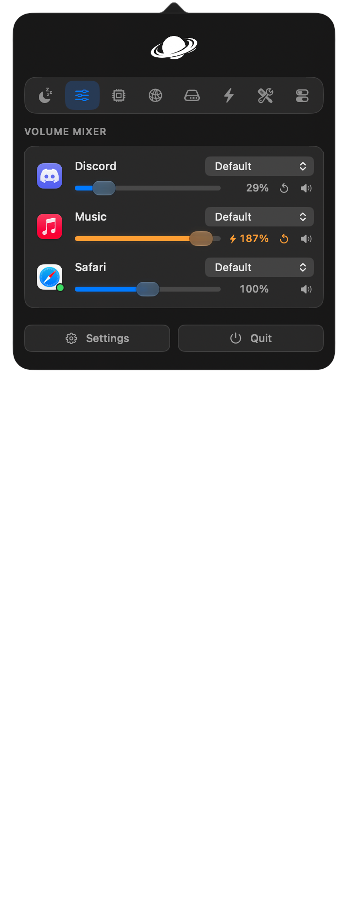
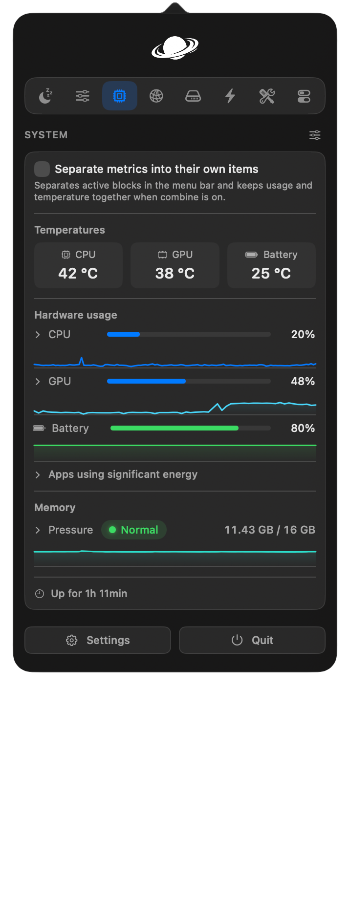
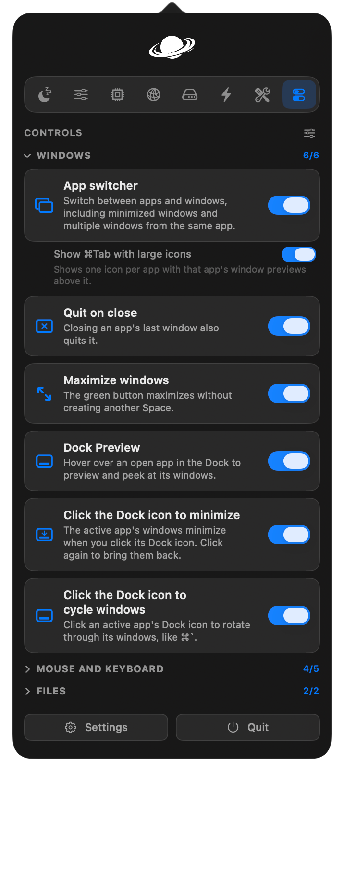
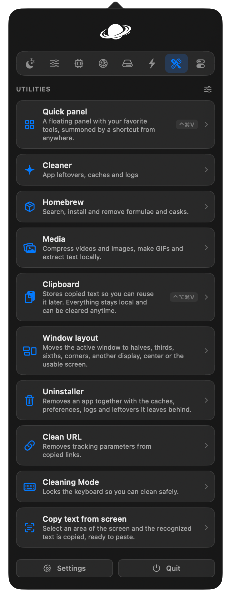
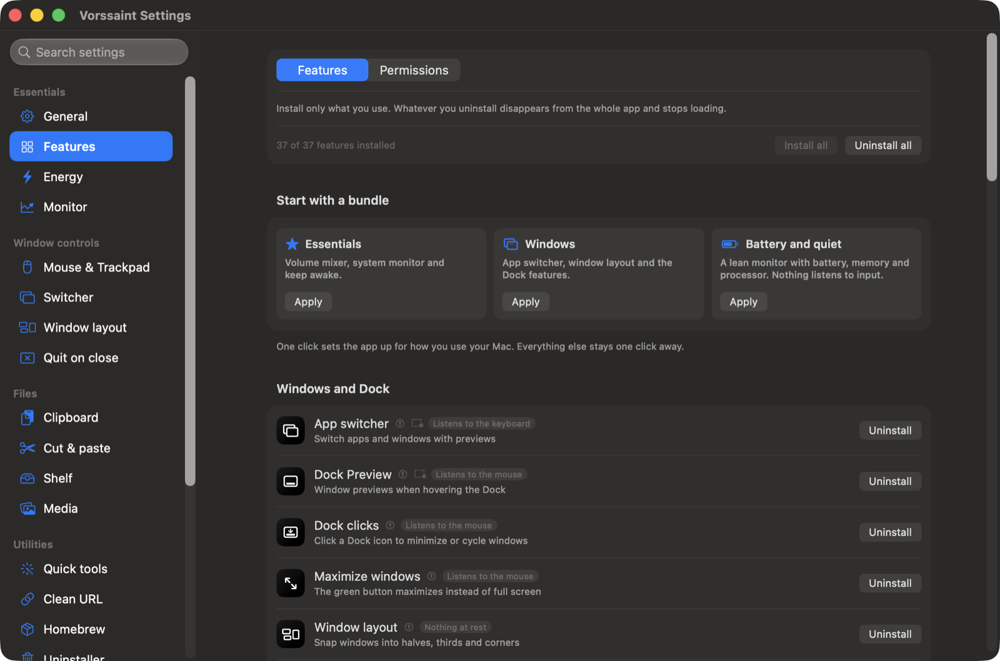
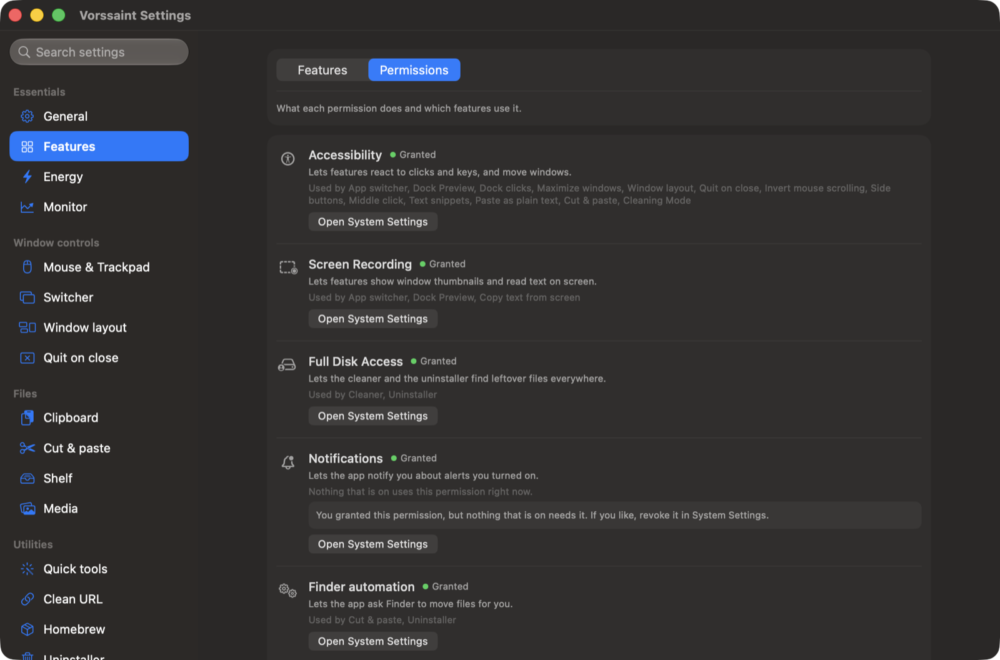

<p align="center">
  <picture>
    <source media="(prefers-color-scheme: dark)" srcset="docs/assets/readme/logo-dark.png">
    
  </picture>
</p>

<h1 align="center">Vorssaint</h1>

<p align="center">
  One menu bar icon doing the job of a dozen paid Mac apps.<br>
  Free, open source, and everything runs on your Mac.
</p>

<p align="center">
  <a href="https://vorssaint.com">Website</a> ·
  <a href="#install">Install</a> ·
  <a href="#everything-it-does">Features</a> ·
  <a href="#private-by-default">Privacy</a> ·
  <a href="CHANGELOG.md">Changelog</a>
</p>

<p align="center">
  <a href="https://github.com/vorssaint/vorssaint-utils/releases"></a>
  <a href="https://github.com/vorssaint/vorssaint-utils/releases"></a>
  <a href="https://github.com/vorssaint/vorssaint-utils/actions/workflows/ci.yml"></a>
  <a href="#what-you-need"></a>
  <a href="LICENSE"></a>
</p>

<p align="center">
  <a href="https://trendshift.io/repositories/53716"></a>
</p>

<p align="center">
  
  
  
  
</p>

Per app volume, a real system monitor, a better app switcher, window snapping, Dock previews, clipboard history, text snippets, a file shelf, an uninstaller. The utilities Mac users usually buy one by one, together behind a single menu bar icon, with no account, no telemetry and no subscription.

## Install only what you use

Nobody needs all of it, and Vorssaint is built around that. The Features page installs and uninstalls whole features: what you uninstall disappears from the entire app and stops loading, so it spends no CPU, memory or energy. Nothing is deleted, and installing again brings your old settings back.

Three one click bundles, Essentials, Windows, and Battery and quiet, shape the whole app in one move, and onboarding ends by asking which one you want. Every feature also wears an honest energy badge saying what it keeps alive while on.

<p align="center">
  
</p>

The rest bends the same way: panel sections reorder and hide, the compact layout trades sections for tabs, settings export to a file and import on a new Mac, and the whole app speaks twelve languages.

## Everything it does

### Sound

- **Volume mixer.** Slide any single app up or down while the rest of the Mac stays put, and push a quiet one past 100 percent when a video is just too low. No audio driver, no setup.
- **Per app output.** Send your music to the speakers and a call to your headset at the same time.
- **Output switcher.** Cycle between chosen outputs with one shortcut, and drop the volume automatically when headphones disconnect.
- **Microphone tools.** Pin your favorite input so the Mac stops guessing, and mute the mic everywhere with a click or shortcut.
- **Music app blocker.** Stops the Music app from bursting in when headphones connect.

### Know what your Mac is doing

- **System monitor.** CPU, GPU, memory pressure and temperatures with history graphs, plus battery health, cycle count, power draw and which apps are burning energy right now.
- **Menu bar readouts.** Keep the numbers you care about in the bar itself, combined or as separate items.
- **Network.** Live rates, session totals and a built in speed test.
- **Alerts.** Optional notifications for sustained CPU load, high temperature, memory pressure, low disk space and low battery.

### Windows and the Dock

- **App switcher.** A richer take on pressing ⌘Tab, with live window thumbnails, minimized windows included, and more than one window per app.
- **Window layout.** Snap the active window to halves, thirds, sixths, corners, center or another display, each with its own optional shortcut.
- **Dock Preview.** Hover a Dock icon to peek at that app's windows and jump straight into the right one.
- **Dock clicks.** Click the Dock icon of the active app to minimize its windows, or cycle through them one by one.
- **Maximize windows.** The green button fills the screen without creating another Space, and puts the window back on the next click.
- **Quit on close.** Apps you choose quit when their last window closes.

<p align="center">
  
</p>

### Keyboard and mouse

- **Text snippets.** Type a short trigger anywhere and it becomes your text, expanded instantly or after a space, with date, time and clipboard variables.
- **Smooth scrolling.** Gives a mouse wheel the glide of a trackpad.
- **Scroll direction.** Invert the wheel without touching the trackpad's natural scrolling.
- **Side buttons.** The mouse Back and Forward buttons start meaning it, in Finder, browsers and compatible apps.
- **Middle click.** A three finger press becomes a real middle click.
- **Key debounce.** Filters the double letters a worn keyboard invents.

### Clipboard, files and links

- **Clipboard history.** Local history of text, images and files with pinned favorites, search and quick paste shortcuts.
- **Paste as plain text.** One shortcut pastes without fonts, colors or links, and the original stays on the clipboard.
- **Shelf.** Park files, text and links near your cursor mid drag, then drop them where they belong later.
- **Finder cut and paste.** ⌘X and ⌘V move files the way you always expected them to.
- **Clean URL.** Strips tracking parameters from copied links, on demand or automatically.

### Everyday tools

- **Quick panel.** ⌃⌘V opens a small floating palette with your favorite tools one key away.
- **Copy text from screen.** Select any area and its text is recognized offline, straight onto the clipboard.
- **Color picker.** Grab any pixel with the system loupe as HEX, RGB, HSL or SwiftUI code.
- **Cleaner.** Sweeps app leftovers, caches and logs, by hand or on a schedule.
- **Uninstaller.** Drop an app in and take its caches, preferences and logs to the Trash with it.
- **Media tools.** Compress videos and images, make GIFs and extract text, all locally.
- **Homebrew manager.** Search, install and remove formulae and casks without opening a terminal.
- **Cleaning Mode.** Locks the keyboard so you can wipe it without typing a novel.

### Energy and display

- **Keep awake.** Keep the Mac up for a timer or until you say stop, including with the lid closed, and see the remaining time next to the icon.
- **Screen brightness.** One slider per display, external monitors included, right in the menu bar panel. External screens are driven over DDC, the same channel their own buttons use, and connections that cannot carry it fall back to dimming the picture, so the slider works on any monitor. The keyboard brightness keys can follow the pointer, changing whichever display it is on.
- **Extra brightness.** Pushes the XDR panel of a MacBook Pro past its regular maximum using the display's HDR headroom.

## Install

With [Homebrew](https://brew.sh):

```sh
brew install --cask vorssaint/tap/vorssaint
```

Already running it? Adopt your copy into Homebrew without a reinstall:

```sh
brew install --cask --adopt vorssaint/tap/vorssaint
```

Updates then arrive with `brew upgrade --cask vorssaint`. Or grab the disk image from the [releases page](https://github.com/vorssaint/vorssaint-utils/releases) and drag Vorssaint into Applications.

Builds are signed with an Apple Developer ID and notarized, so macOS opens them without a fuss and your permissions survive updates.

## Private by default

Vorssaint has no backend, no account, no analytics and no tracking. The network is touched only by things you can see: update checks, the speed test, and Homebrew searches and installs you start. The full story is in the [privacy notes](docs/PRIVACY.md).

Permissions get the same treatment. Every one is optional, the app explains each in plain words, shows which features actually use it, and even tells you when a permission you granted is no longer needed by anything, with a shortcut to revoke it.

<p align="center">
  
</p>

| Permission | Used by | Without it |
|---|---|---|
| Accessibility | Switcher, Dock features, window controls, mouse and keyboard features, snippets, cut and paste | Those features stay off |
| Screen Recording | Switcher and Dock Preview thumbnails, copy text from screen | Previews fall back or stay off |
| System Audio Recording | Per app volume and output routing | Apps stay on normal system audio |
| Notifications | Keep awake, battery, monitor and update alerts | The app stays silent |
| Full Disk Access, optional | Deeper cleaner and uninstaller scans | Only reachable places are scanned |
| Administrator, once, optional | Password free closed lid toggling | A password prompt per toggle |

The shelf needs no permission at all. Finder cut and paste, the uninstaller and the Homebrew terminal handoff ask macOS for Automation access the first time they talk to Finder or Terminal.

## What you need

- A Mac with Apple Silicon
- macOS 14 Sonoma or newer

### Build it yourself

```sh
git clone https://github.com/vorssaint/vorssaint-utils.git
cd vorssaint-utils
./build.sh            # compile, generate the icon, assemble the signed bundle
./build.sh --install  # the same, then install into Applications and launch
```

Xcode Command Line Tools are the only requirement. The [contributing guide](CONTRIBUTING.md) covers the layout and conventions. Official builds come only from the maintainer: the GPL covers the source, while the Vorssaint name, icon and look are covered by [TRADEMARKS.md](TRADEMARKS.md), so forks need their own identity.

## When something misbehaves

The [troubleshooting guide](docs/TROUBLESHOOTING.md) walks through the common cases: the app blocked on first launch, a permission that will not stick, thumbnails showing as icons. To remove Vorssaint completely, `./Tools/uninstall.sh` quits the app, drops the login item, resets its privacy grants and deletes every trace.

## Documentation

- [Privacy](docs/PRIVACY.md), what does and does not leave your Mac
- [Permissions](docs/PERMISSIONS.md), every macOS permission in plain words
- [Troubleshooting](docs/TROUBLESHOOTING.md), the common fixes
- [Contributing](CONTRIBUTING.md), build, layout and conventions
- [Support](SUPPORT.md), where to get help
- [Security](SECURITY.md), how to report a vulnerability

## Community

Vorssaint went from first commit to the front of GitHub trending in three days, top of the Swift charts, and issues and pull requests have shaped every release since. Bug reports, feature ideas and translations are all welcome, starting from the [contributing guide](CONTRIBUTING.md).

Vorssaint is free and will stay that way. If it earned its place in your menu bar, a star helps other people find it, and a [coffee](https://buymeacoffee.com/vorssaint) keeps the maintainer awake, with or without the Keep awake feature.

## License

[GPL 3.0 or later](LICENSE), copyright 2026 Vorssaint. The license covers the source code; the Vorssaint name, logo and look are covered separately in [TRADEMARKS.md](TRADEMARKS.md).

<p align="center">
  <sub>Made by <a href="https://x.com/vorssaint">@vorssaint</a></sub>
</p>
