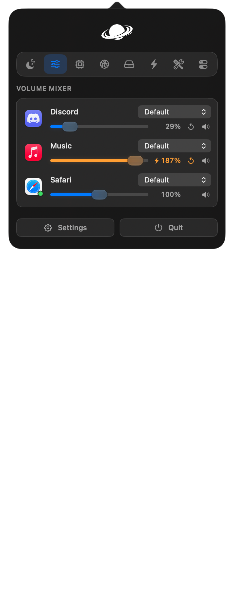
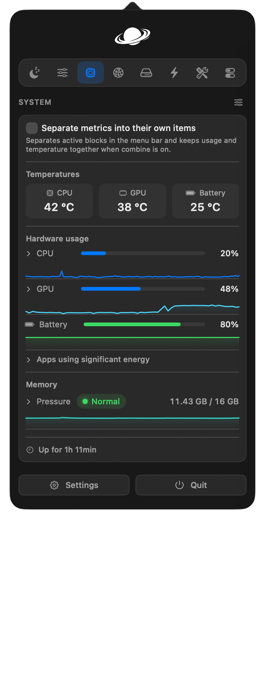
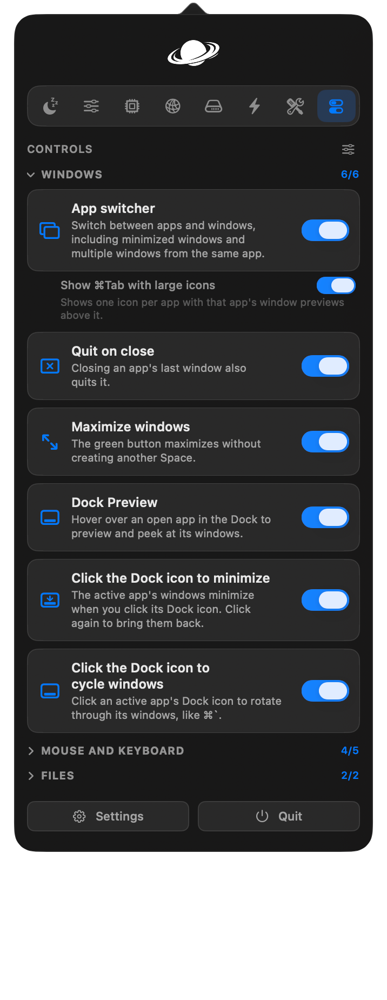
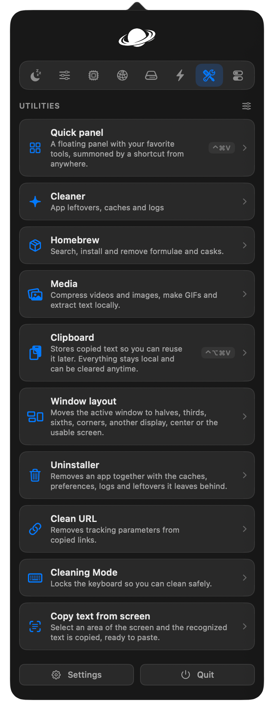
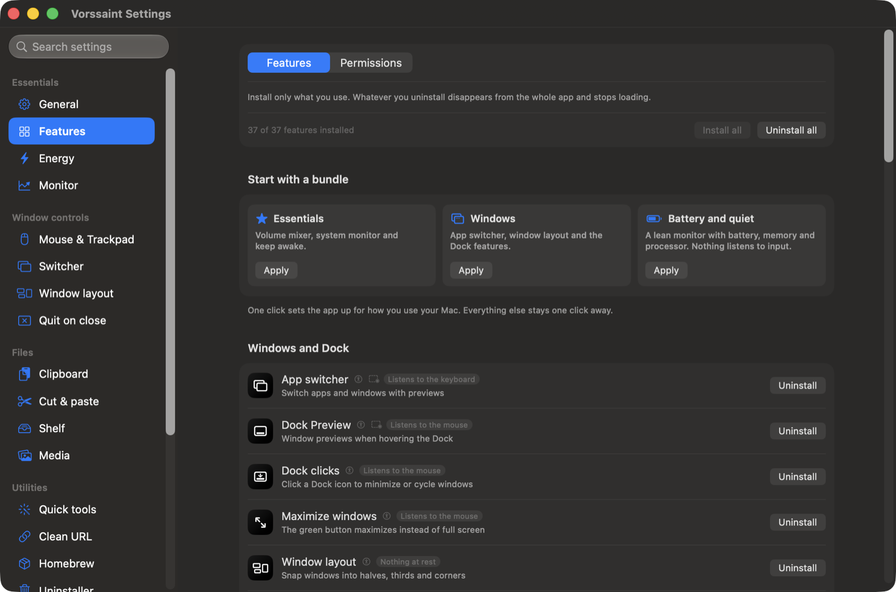
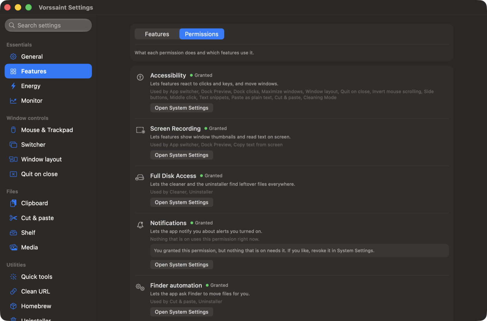

<p align="center">
  <picture>
    <source media="(prefers-color-scheme: dark)" srcset="docs/assets/readme/logo-dark.svg">
    
  </picture>
</p>

<h1 align="center">Vorssaint</h1>

<p align="center">
  One menu bar icon doing the job of a dozen paid Mac apps.<br>
  Free, open source, and local-first.
</p>

<p align="center">
  <a href="https://vorssaint.com">Website</a> ·
  <a href="#install">Install</a> ·
  <a href="#everything-it-does">Features</a> ·
  <a href="#private-by-default">Privacy</a> ·
  <a href="CHANGELOG.md">Changelog</a> ·
  <a href="mailto:hello@vorssaint.com">Contact</a> ·
  <a href="https://discord.gg/M6BwWH4BJp">Discord</a>
</p>

<p align="center">
  <a href="https://github.com/vorssaint/vorssaint-utils/releases"></a>
  <a href="https://github.com/vorssaint/vorssaint-utils/releases"></a>
  <a href="https://github.com/vorssaint/vorssaint-utils/actions/workflows/ci.yml"></a>
  <a href="#what-you-need"></a>
  <a href="LICENSE"></a>
</p>

<p align="center">
  <a href="https://buymeacoffee.com/vorssaint">
    
  </a>
</p>

<p align="center">
  For anything private, email
  <a href="mailto:hello@vorssaint.com"><strong>hello@vorssaint.com</strong></a>.
</p>

<p align="center">
  <a href="https://trendshift.io/repositories/53716?utm_source=repository-badge&amp;utm_medium=badge&amp;utm_campaign=badge-repository-53716" target="_blank" rel="noopener noreferrer"></a>
  <a href="https://trendshift.io/repositories/53716?utm_source=trendshift-badge&amp;utm_medium=badge&amp;utm_campaign=badge-trendshift-53716" target="_blank" rel="noopener noreferrer"></a>
</p>

<p align="center">
  
  
  
  
</p>

Per app volume, a real system monitor, a better app switcher, window snapping, Dock previews, clipboard history, text snippets, a file shelf, an uninstaller. The utilities Mac users usually buy one by one, together behind a single menu bar icon, with no account, no telemetry and no subscription.

## Install only what you use

Choose individual features or start with a preset. Uninstalled features stop loading and disappear from the interface; reinstalling restores their settings. Setup asks only for the permissions your choices need.

<p align="center">
  
</p>

Reorder or hide panel sections, choose a compact layout, and export settings to another Mac. The app supports more than a dozen languages.

## Everything it does

### Sound

- **Volume mixer.** Set volume per app, boost quiet audio past 100%, and pin or reorder favorites. No audio driver required.
- **Per app output.** Play music through speakers while a call uses your headset.
- **Output switcher.** Switch audio outputs with a shortcut and lower the volume when headphones disconnect.
- **Microphone tools.** Choose a preferred input, adjust its level on supported devices, and mute all microphones with one shortcut.
- **Music app blocker.** Prevent unwanted Music launches after detected playback-button presses. Requires Accessibility.

### Know what your Mac is doing

- **System monitor.** CPU, GPU, memory, temperatures, battery health and power use, with history graphs and a view of energy-hungry apps.
- **Fan Control (beta).** Set manual fan speeds or temperature curves and monitor live RPM.
- **Menu bar readouts.** Put your chosen readings, usage bars, battery time or fan speed directly in the menu bar.
- **Network.** See live traffic, session totals and your local IP address, or run a speed test.
- **Alerts.** Get notified about sustained CPU load, high temperatures, memory pressure, low disk space or low battery.

### Windows and the Dock

- **App switcher.** Switch between apps and windows with live previews, search and display filters. A simpler mode works without screen capture.
- **Window layout.** Snap windows into layouts, move them between displays and restore earlier positions using shortcuts, screen edges or modifier-drag gestures.
- **Dock Preview.** Hover over Dock icons to preview windows across desktops. Switch, close, move or snap them from the preview.
- **Dock clicks.** Click an active app's Dock icon to minimize, hide or cycle through its windows.
- **Maximize windows.** Use the green button to fill the screen without creating another Space.
- **Fixed Space order.** Keep Spaces in the order you set instead of rearranging them by recent use. Turning it off restores your previous setting.
- **Quit on close.** Quit selected apps when their last window closes.
- **Quit and close protection.** Prevent accidental ⌘Q or ⌘W with a hold, double press or extra modifier, per app.

<p align="center">
  
</p>

<p align="center">
  
</p>

### Keyboard and mouse

- **Text snippets.** Expand short triggers into text with clipboard, date and time variables, or insert snippets from a searchable menu.
- **Smooth scrolling.** Give your mouse wheel a fluid glide with adjustable speed and response.
- **Pointer acceleration.** Disable mouse acceleration and restore your previous setting when turned off.
- **Focus follows mouse.** Bring the window under the pointer forward after an adjustable pause.
- **Scroll direction.** Invert vertical and horizontal mouse scrolling independently of the trackpad.
- **Scroll sideways while holding a key.** Turn vertical wheel movement into horizontal scrolling while holding a chosen key.
- **Side buttons.** Use mouse Back and Forward buttons in Finder, browsers and compatible apps.
- **Mouse button shortcuts.** Assign keys to extra buttons and side wheels, or use button-drag gestures for Spaces and Mission Control.
- **Middle click.** Turn a three-finger trackpad press into a middle click.
- **Apps to leave alone.** Exclude chosen apps from mouse enhancements.
- **Extra click filter.** Ignore accidental rapid clicks from worn mouse buttons without delaying normal clicks.
- **Key debounce.** Filter repeated letters caused by a worn keyboard.
- **Super key.** Use Caps Lock or a right-side modifier as a shortcut combination, with a separate tap action and app exclusions.
- **Keyboard shortcuts.** Manage feature shortcuts in one place, including optional takeover of supported macOS shortcuts while a feature is active.

### Clipboard, files and links

- **Clipboard history.** Search local text, image and file history, pin favorites, preview entries and paste with shortcuts.
- **Auto clear clipboard.** Clear the system clipboard after a delay, sleep or lock, while keeping saved history.
- **Paste as plain text.** Paste without formatting while preserving the original clipboard content.
- **Shelf.** Park files, text and links near your cursor while dragging, then drop or share them later.
- **Finder shortcuts.** Move files with ⌘X and ⌘V, rename with F2, or paste copied images as PNG files.
- **Clean URL.** Remove tracking parameters from links, manually or automatically.
- **Disk image installer.** Install an app from a mounted disk image and eject it, with optional download cleanup.

### Everyday tools

- **Dynamic Island.** Keep music, notifications, calendars, timers, downloads and everyday controls around the camera cutout, or a simulated one on other Macs. Customize sections and shortcuts, with optional lyrics, a live equalizer, camera preview and file tools.
- **AI agents.** Follow Claude and Codex in the Dynamic Island: plan limits and when they reset, tokens, API value, models, projects and live work, with a notice when a long task finishes.
- **Command Bar.** Search apps, windows, files, clipboard history, snippets and app menu commands from one field. Calculate, convert units, find emoji or run saved scripts.
- **Quick panel.** Open a floating palette of favorite tools with ⌃⌘V.
- **Quick toggles.** Switch appearance, hide desktop icons, eject disks, empty the Trash, lock the screen and more.
- **Radial menu.** Open a customizable wheel of apps, files, shortcuts and tools around the pointer, with profiles and submenus.
- **Scratchpad.** Keep autosaved notes in tabs, with Markdown preview and export, in a floating window or Dynamic Island.
- **Cleaning Mode.** Lock keyboard input while cleaning, with a black screen or a small visible indicator.

### Capture and create

- **Screen capture.** Switch between screenshots, recording, text recognition and color picking in one selector with a pixel magnifier.
- **Screenshot.** Capture an area, window, screen or scrolling page. Annotate, crop, redact, add backgrounds and watermarks, pin captures, send them through the Share menu or share an expiring link.
- **Screen recording.** Record with separate system-audio and microphone tracks. Trim, cut, add automatic zooms, blur private details and export video or GIFs, or share an expiring link.
- **Camera preview.** Check your camera in a floating mirror or Dynamic Island before a call.
- **Copy text from screen.** Recognize text offline from any screen area, or read a QR code.
- **Color picker.** Copy a screen color as HEX, RGB, HSL or SwiftUI code.
- **Media tools.** Compress and edit videos, batch-convert images, add watermarks, make GIFs and extract text, all locally.

### App management

- **App updates.** Check store apps, package-managed apps and supported developer feeds in one list. Install managed updates together or open an app's own updater.
- **Cleaner.** Remove caches, logs and app leftovers, manually or on a schedule.
- **Messaging downloads.** Review, organize or move messaging downloads to the Trash using retention rules.
- **Uninstaller.** Remove apps and review their related caches, preferences and helpers before moving them to the Trash.
- **Homebrew manager.** Search, install and remove formulae and casks without opening a terminal.
- **Port manager.** Find processes listening on network ports and stop them with Kill Process when installed.

### Energy and display

- **Keep awake.** Keep your Mac working on a timer, with the lid closed, or while selected apps, power or external displays are present.
- **Displays.** Control individual displays and brightness, with hardware control where supported and software dimming as a fallback.
- **Extra brightness.** Use a MacBook Pro XDR display's HDR headroom to go beyond its normal maximum brightness.
- **Bluetooth on sleep.** Disconnect Bluetooth during sleep and restore it on wake only if Vorssaint turned it off.

## Install

With [Homebrew](https://brew.sh):

```sh
brew install --cask vorssaint
```

Or grab the disk image from the [releases page](https://github.com/vorssaint/vorssaint-utils/releases) and drag Vorssaint into Applications.

Builds are signed with an Apple Developer ID and notarized, so macOS opens them without a fuss and your permissions survive updates.

## Uninstall

With Homebrew:

```sh
brew uninstall --cask vorssaint
```

To remove Vorssaint completely, including its settings and permissions:

```sh
./Tools/uninstall.sh
```

## Private by default

Vorssaint is local-first, with no account, analytics or tracking. The network is touched only by things you can see: update checks, the speed test, Homebrew actions, optional online lyric lookup, temporary screenshot or recording links and feedback you explicitly send. The full story is in the [privacy notes](docs/PRIVACY.md).

Permissions get the same treatment. Every one is optional, the app explains each in plain words, shows which features actually use it, and even tells you when a permission you granted is no longer needed by anything, with a shortcut to revoke it.

<p align="center">
  
</p>

See the [permissions guide](docs/PERMISSIONS.md) for which features need access and what remains available without it.

## What you need

- A Mac with Apple Silicon
- macOS 14 Sonoma or newer

### Build it yourself

```sh
git clone https://github.com/vorssaint/vorssaint-utils.git
cd vorssaint-utils
./build.sh --dev            # build the separate Developer variant
./build.sh --dev --install  # install and launch it
```

Xcode Command Line Tools are the only requirement. The [contributing guide](CONTRIBUTING.md) covers the layout and conventions. Official builds come only from the maintainer: the GPL covers the source, while the Vorssaint name, icon and look are covered by [TRADEMARKS.md](TRADEMARKS.md), so forks need their own identity.

## When something misbehaves

See [troubleshooting](docs/TROUBLESHOOTING.md) for launch problems, permissions and missing previews, or [support](SUPPORT.md) for help.

## Documentation

- [Privacy](docs/PRIVACY.md), what does and does not leave your Mac
- [Permissions](docs/PERMISSIONS.md), every macOS permission in plain words
- [Troubleshooting](docs/TROUBLESHOOTING.md), the common fixes
- [Contributing](CONTRIBUTING.md), build, layout and conventions
- [Support](SUPPORT.md), where to get help
- [Security](SECURITY.md), how to report a vulnerability

## Community

Vorssaint went from first commit to the front of GitHub trending in three days, top of the Swift charts, and issues and pull requests have shaped every release since. Bug reports, feature ideas and translations are all welcome, starting from the [contributing guide](CONTRIBUTING.md).

Vorssaint is free and will stay that way. If it earned its place in your menu bar, a star helps other people find it, and a [coffee](https://buymeacoffee.com/vorssaint) keeps the maintainer awake, with or without the Keep awake feature.

## Acknowledgements

- App icon designed by [@divisionseven](https://github.com/divisionseven)

## License

[GPL 3.0 or later](LICENSE), copyright 2026 Vorssaint. The license covers the source code; the Vorssaint name, logo and look are covered separately in [TRADEMARKS.md](TRADEMARKS.md).

<p align="center">
  <sub>Made by <a href="https://x.com/vorssaint">@vorssaint</a></sub>
</p>
